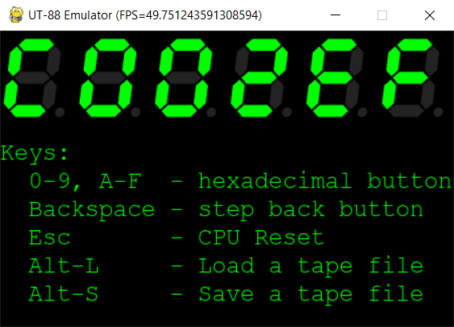
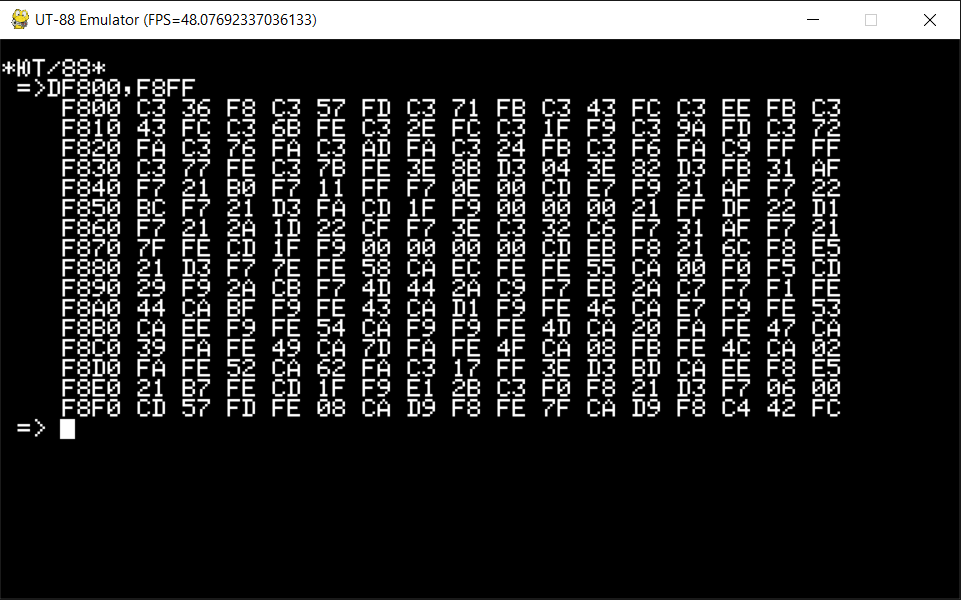
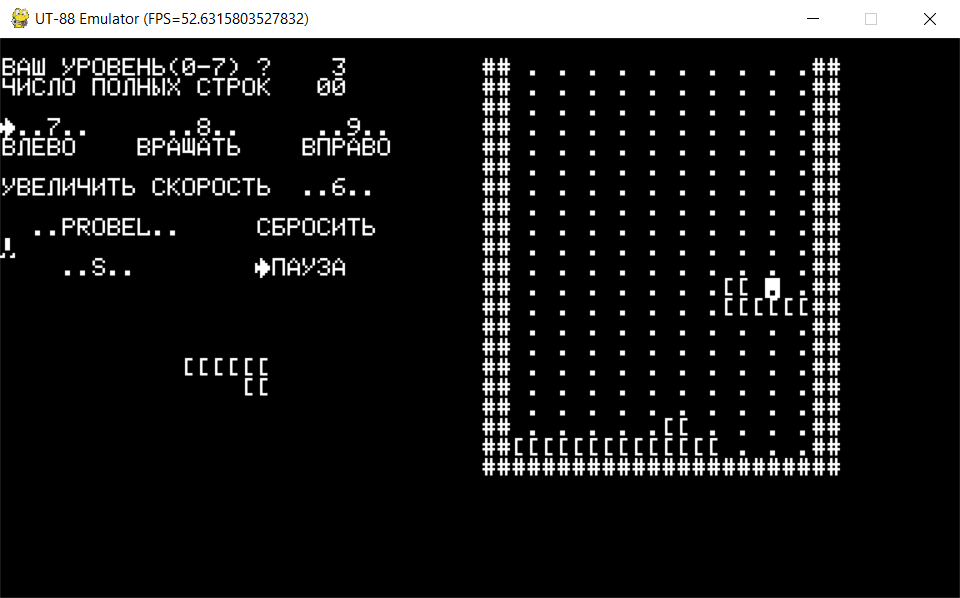
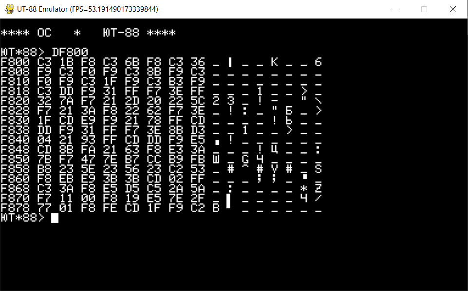
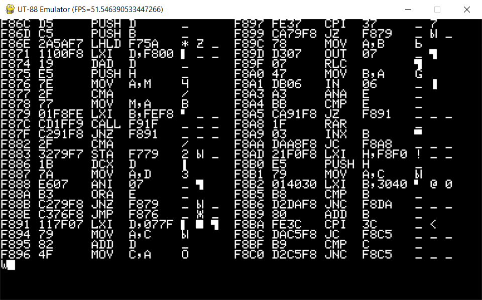

# UT-88 Soviet DIY i8080-based Computer Emulator

This is an emulator of the UT-88 computer, developed using Python. The project has two primary objectives:
- Understand the computer schematics, and emulate it as close as possible to the real hardware
- Understand software part of the computer, disassemble and document it

Additionally, this project serves as the most comprehensive repository of UT-88 related information, encompassing:
- scematics and modules descriptions
- binary files (addressing numerous scanning issues compared to other binaries available on the internet)
- Disassembly of every program ever published for the UT-88, and even beyond.

## UT-88 - Computer Description

UT-88 (Russian: ЮТ-88) is a DIY computer originally introduced in "Young Technician - For Skilled Hands" magazine (Russian: "ЮТ Для Умелых Рук") on Feb 1989. In late 1980s, a typical DIY computers were notably complex, comprised of numerous components, and demanded substantial technical expertise to assemble and bring it up. In contrast, the UT-88 presented an elegantly simple design and a step-by-step construction process. This approach significantly broadened its appeal to a wider audience, including children and hobbyists.

The magazine featured both computer schematics and software code, with the intention of guiding readers through a computer construction process in several phases:
- **Basic Configuration:** The CPU module resembled a calculator, featuring a 6-digit LCD display and a hexadecimal button keypad. See detailed description of the basic configuration including hardware and software description [here](doc/cfg_basic.md).
- **Calculator Add-on:** This expanded the capabilities by incorporating a ROM with floating-point functions, enabling scientific calculations.
- **Video Module:** The next phase introduced a 55-key alphanumeric keyboard and a 64x28 character monochrome display (with TV output).
- **Dynamic 64k RAM:** This upgrade allowed users to run programs from other compatible computers.
- **64k-256k Quasi Disk:** A battery-powered dynamic RAM was added, providing the capacity to store a substantial amount of data.
- **Custom Add-ons:** In addition to the phases listed above, there were custom add-ons, including a Flash memory programmer and an i8253-based sound generator.

These phases offered readers a structured approach to gradually build and enhance the UT-88 computer according to their preferences and needs. Each phase of the UT-88 build not only expanded the hardware but also enriched the software capabilities, providing users with a versatile computing experience.

From a software perspective, each phase of the UT-88 computer build introduced additional functionalities:
- **Basic Configuration:** In the basic configuration, users could perform basic computer operations such as memory read/write, CRC calculations, load programs from tape, and create and execute simple programs.
- **Video Module:** With the video module installed, the UT-88 could run text-based programs, including simple text-based video games.
- **Full Configuration:** Achieving the full configuration unlocked the ability to run the UT-88 operating system. This OS offered essential tools like a full screen text editor and an assembler, enhancing compatibility with other i8080-based computers.
- **Special CP/M Port:** The magazine also provided an unique port of the CP/M operating system, enabling users to work with files stored on the quasi disk, expanding the computer's capabilities even further.

The architecture of the UT-88 computer draws significant inspiration from two previously published computer systems: the Micro-80 (from the early 1980s) and the Radio-86RK (featured in the 'Radio' magazine between 1985 and 1987). Several technical solutions and design elements are inherited from these predecessors, enhancing the UT-88's overall functionality and compatibility. Key elements carried over from its predecessors include connectivity with tape recorders and the associated recording format, the layout and schematics of the keyboard, and the general hardware framework.

Notably, the UT-88 distinguishes itself by incorporating more advanced and refined schematics. This includes the integration of components like the i8224 and i8238, which replace a multitude of TTL logic gate chips used in the Radio-86RK. Additionally, the UT-88's peripheral are connected to the CPU using I/O address space, in contrast to the Radio-86RK where peripherals were located within the main memory address space. Furthermore, the UT-88's design takes into account chip availability, addressing the scarcity of the i8275 chip in late USSR. In response, the UT-88's video module employs a combination of registers and counters, providing a practical alternative for the video signal generation.

On the software front, the UT-88 maintains a high degree of compatibility with its predecessors. For instance, the Monitor F, which serves as the primary firmware for the Video Module, closely resembles the Radio-86RK Monitor and shares common routine entry points. This compatibility allows for the loading and execution of Radio-86RK programs from tape with minimal to no modifications, underscoring the seamless transition between these related computer systems.

Scans of the original magazine can be found [here](doc/scans).


## UT-88 Video Module

The Video Module is a pivotal addition to the UT-88 computer, bringing with it a 64x28 character monochrome display and a 55-key keyboard. With this module in place, the UT-88 transforms into a fully-fledged computer, capable of running text-based video games, text editors, programming language compilers, and a wide array of applications.

The Video Module not only enhances the UT-88's functionality but also offers a high level of compatibility with previously released Radio-86RK and its various modifications. This compatibility ensures that using and porting programs from the Radio-86RK to the UT-88 is a straightforward and manageable task. It effectively bridges the gap between these related computer systems, enabling a seamless transition of software and expanding the UT-88's capabilities.

Here's a detailed description of the hardware additions to the UT-88 computer:
- **Video Adapter**: 
  - The Video Adapter is built around a 2-port RAM located in the address range `0xe800`-`0xefff`. One port of this memory is connected to the computer's data bus and functions like regular memory. A specialized circuit, consisting of counters and logic gates, reads the video memory through the second port and converts it into a TV signal.
  - The video adapter is capable of displaying a 64x28 monochrome character matrix, with each character being 6x8 pixels in size.
  - A dedicated 2k ROM (not connected to the data bus) serves as a font generator. It contains 2 characters sets. Schematically only lower part is connected to system. Upper part of the ROM may be connected *instead* with a minor hardware modifications (e.g. by adding a switch). The font ROM is dumped [here](doc/ut88_font.txt), along with the comparison between fonts, and bugs description.
  - Lower 1k of the Font ROM contains 128 chars in the KOI-7 N2 encoding: characters in the `0x00`-`0x1f` range providing pseudo-graphic symbols, characters in the `0x20`-`0x5f` range matching the standard ASCII table, and characters in the `0x60`-`0x7f` range allocated for Cyrillic symbols.
  - Upper 1k contains alternative font, that matches KOI-7 N1 encoding. `0x00`-`0x1f` range provides a different set of pseudo-graphic symbols. `0x20`-`0x3f` range matches to ASCII symbol set, `0x40`-`0x7f` range represents upper and lower case cyrillic chars. There are no Latin chars in this font. All chars supposed to be printed with latin letters in fact are printed with lower case cyrillic symbols.
  - The highest bit of each character signals the video controller to invert the symbol.
- **Keyboard**:
  - The keyboard is connected via an i8255 chip to ports 0x04-0x07, with the two lowest bits of the address inverted.
  - The keyboard comprises a 7x8 button matrix connected to Port A (columns) and Port B (rows) of the i8255. Three modification keys are used to enter special, control, and Cyrillic symbols and are connected to Port C.
  - The keyboard matrix scanning and conversion of scan codes to ASCII character values are managed by Monitor F.
- **Memory Additions**:
  - A 1k RAM is located at the address range `0xf400`-`0xf7ff`.
  - A 2k ROM, containing Monitor F, resides in the address range `0xf800`-`0xffff`.
  - Optionally, a 4k RAM can be connected to the address range `0x3000`-`0x3fff`.
- **External ROM Support**:
  - An optional external ROM can be connected via another i8255 chip at ports `0xf8`-`0xfb`. However, it's worth noting the schematics of the external ROM was published 2 years later than the other computer components. Unfortunately the firmware support does not look correct. 

The Video Module seamlessly integrates with the CPU Basic Module components, allowing for the coexistence of these hardware modules. In the Video Module configuration, the Tape Recorder connection is utilized at port `0xa1`, and the LCD screen connected to addresses `0x9000`-`0x9002` can be employed to display various information, such as the current time. Some other components, such as the Monitor 0 ROM at addresses `0x0000`-`0x03ff`, may be disconnected and replaced with alternative memory modules, such as additional RAM. Additionally, the hexadecimal keyboard is not used in the Video Module configuration.

The primary firmware for the Video Module is Monitor F, as it resides at memory addresses starting from `0xf800`. Monitor F provides a comprehensive set of routines to interact with the new hardware components, including display and keyboard input. These routines are accessed via static and predefined entry points, each serving specific purposes:
- `0xf800`    - Software reset
- `0xf803`    - Wait for a keyboard press, returning the entered symbol in register A
- `0xf806`    - Input a byte from the tape (A - number of bits to receive or `0xff` if synchronization is needed). Returns the received byte in register A.
- `0xf809`    - Put a character to the display at the cursor location (C - character to print)
- `0xf80c`    - Output a byte to the tape (C - byte to output)
- `0xf80f`    - This function is supposed to print a byte on a printer. Since the printer connectivity is not implemented in UT-88, this function is just an alias for `0xf809` (put char to the display)
- `0xf812`    - Check if any button is pressed on the keyboard (A=`0x00` if no buttons are pressed, `0xff` otherwise)
- `0xf815`    - Print a byte in a 2-digit hexadecimal form (A - byte to print)
- `0xf818`    - Print a NULL-terminated string at the cursor position (HL - pointer to the string)
- `0xf81b`    - Scan a keyboard, returning when a stable scan code is read (returns the scan code in register A)
- `0xf81e`    - Get the current cursor position (offset from `0xe800` video memory start, returned in registers HL)
- `0xf821`    - Get the character under the cursor (returned in register A)
- `0xf824`    - Load a program from tape (HL - offset, returns CRC in registers BC)
- `0xf827`    - Output a program to the tape (HL - start address, DE - end address, BC - CRC)
- `0xf82a`    - Calculate CRC for a memory range (HL - start address, DE - end address, result in registers BC)

These predefined entry points simplify interaction with the Video Module hardware and enable efficient development of software that leverages its capabilities. For detailed information on arguments and return values, as well as algorithm descriptions, please refer to the [Monitor F disassembly](doc/disassembly/monitorF.asm).

The character output function operates in a terminal mode, where the symbol is printed at the cursor's current position, and then the cursor advances to the next position. When the cursor reaches the end of a line, it automatically advances to the next line. If the cursor reaches the bottom-right position of the screen, the screen is scrolled down by one line to make room for additional text.

Additionally, the character output function supports several control symbols for special actions:
- `0x08`  - Moves the cursor one position to the left.
- `0x0c`  - Moves the cursor to the top-left position of the screen.
- `0x18`  - Moves the cursor one position to the right.
- `0x19`  - Moves the cursor one line up.
- `0x1a`  - Moves the cursor one line down.
- `0x1f`  - Clears the entire screen.
- `0x1b`  - Moves the cursor to a specific position. This is achieved using a 4-symbol sequence, similar to an Escape sequence, consisting of `0x1b`, `'Y'`, `0x20` + Y position, and `0x20` + X position.

In addition to its general-purpose routines, Monitor F offers a basic command console that provides users with several essential capabilities:
- **View, Modify, Copy, and Fill Memory Data**: Users can interactively view the contents of memory, make modifications to memory values, copy data from one memory location to another, and fill specific memory ranges with desired values. These commands are invaluable for low-level memory manipulation and debugging.
- **Input from and Output Programs to the Tape Recorder**: Monitor F allows users to load programs from a connected tape recorder into the computer's memory. It also provides the functionality to save programs from memory onto a tape recorder for storage or sharing. These operations are crucial for program transfer and archival purposes.
- **Run User Programs with Breakpoint Possibility**: Users can execute their own programs loaded into memory. Monitor F offers the convenience of setting breakpoints, which enable users to pause program execution at specific memory addresses. Breakpoints are a valuable tool for debugging and tracing program flow.
- **Handle Time Interrupt and Display Current Time**: The Monitor F console includes functionality for handling time interrupts and displaying the current time. This feature is especially useful for applications that require precise timing or for monitoring the passage of time during program execution.

The following commands are supported by the Monitor F:
- **Memory commands**:
  - `D` `<addr1>`, `<addr2>`        - Dump the memory range in hexadecimal format.
  - `L` `<addr1>`, `<addr2>`        - List the memory range in text format, with '.' indicating non-printable characters.
  - `K` `<addr1>`, `<addr2>`        - Calculate the CRC for the specified memory range.
  - `F` `<addr1>`, `<addr2>`, `<val>` - Fill the memory range with the provided constant value.
  - `S` `<addr1>`, `<addr2>`, `<val>` - Search for the specified byte value in the memory range.
  - `T` `<src1>`, `<src2>`, `<dst>`   - Copy (Transfer) the memory range specified by `<src1>`-`<src2>` to the destination `<dst>`
  - `C` `<src1>`, `<src2>`, `<dst>`   - Compare the memory range specified by `<src1>`-`<src2>` with the range starting from `<dst>`
  - `M` `<addr>`                  - View and edit memory starting at address `<addr>`
- **Tape commands**:
  - `O` `<start>`, `<end>`[, `<spd>`] - Save the memory range to the tape. Optionally, use the speed constant if provided.
  - `I` `<offset>`[, `<spd>`]       - Load a program from the tape and apply the specified offset. Optionally, use the speed constant.
  - `V`                         - Measure the tape loading delay constant.
- **Program execution**:
  - `W`                         - Start the program from address `0xc000`.
  - `U`                         - Start the program from address `0xf000`.
  - `G` `<addr>`[, `<brk`>]         - Start or continue the program from the specified address `<addr>`. Optionally, set a breakpoint at address `<brk>`.
  - `X`                         - View and modify CPU registers when a breakpoint is hit.
- **Time commands**:
  - `B`                         - Display the current time at the CPU module's LCD.
- **External ROM**:
  - `R` `<start>`, `<end>`, `<dst>`   - Import data from the external ROM in the range `<start>`-`<end>` to the destination memory location `<dst>`.

The tape format used in Monitor F is an extension of the format used in Monitor 0, with two notable additions:
- The recording format now includes a CRC, which is used for error detection. Monitor F can detect a CRC mismatch between the stored CRC value and the calculated CRC value, allowing it to report this discrepancy to the user.
- Users have the option to adjust the tape speed by specifying a "tape constant". This tape constant represents the delay between individual bits in the recorded data. This feature is included to standardize the format and accommodate potential variations in tape recording speeds due to differences in crystal frequencies between computers like Micro-80 and Radio-86RK.

The tape recording format, with the additional fields introduced in Monitor F, is as follows:
- 256 x `0x00` - pilot tone
- `0xe6`       - Synchronization byte
- 2 byte       - start address (high byte first)
- 2 byte       - end address (high byte first)
- data bytes   - program data bytes
- `0x0000`     - micro-pilot tone (2 bytes)
- `0xe6`       - Synchronization byte
- 2 byte       - Calculated CRC (high byte first)

These enhancements to the tape format improve data integrity and provide greater flexibility in working with tape recordings, ensuring accurate program loading and error detection during the tape loading process.

Memory map of the UT-88 in the Video Configuration:
- `0x0000`-`0x03ff` - CPU Module ROM (Monitor 0, Optional)
- `0x3000`-`0x3fff` - Optional 4k RAM
- `0xc000`-`0xc3ff` - CPU Module RAM (Optional)
- `0xe800`-`0xefff` - Video RAM
- `0xf400`-`0xf7ff` - Video Module RAM
- `0xf800`-`0xffff` - Video Module ROM (Monitor F)

I/O address space map:
- `0x04`  - Keyboard i8255 Control register
- `0x05`  - Keyboard i8255 Port C (Mod keys)
- `0x06`  - Keyboard i8255 Port B (Keyboard matrix rows)
- `0x07`  - Keyboard i8255 Port A (Keyboard matrix column)
- `0xf8`  - (Optional) external ROM i8255 Port A
- `0xf9`  - (Optional) external ROM i8255 Port B
- `0xfa`  - (Optional) external ROM i8255 Port C
- `0xfb`  - (Optional) external ROM i8255 Control register
- `0xa1`  - tape recorder

From a software perspective, the Video Module transforms the UT-88 into a classic computer with the essential components of a keyboard and monitor. This expansion enables the UT-88 to operate as a traditional computer with typical terminal-like routines expected from this type of machine. It opens the door for various software applications and interactions that are common to such computers.

One notable program published for the UT-88 with the Video Module is the Tetris game, which offers an engaging gaming experience. The Tetris game allows users to enjoy the classic block-stacking challenge on their UT-88 computer. You can find the program tape for Tetris [here](tapes/TETR1.GAM) and explore its disassembly [here](doc/disassembly/tetris.asm)).

Video module schematics can be found here: [part 1](doc/scans/UT22.djvu), [part 2](doc/scans/UT24.djvu).


## 64k Dynamic RAM

The upgrade to a 64k dynamic RAM module ([schematics](doc/scans/UT38.djvu)) significantly enhances UT-88 computer memory capabilities. While the RAM module covers the entire 64k address space, it includes special logic to disable the dynamic RAM for specific address ranges, such as `0xe000`-`0xefff` (video RAM) and `0xf000`-`0xffff` (reserved for Monitor F RAM/ROM). As a result, the effective dynamic RAM size is 56k.

This additional RAM capacity opens up the possibility of running a wider range of programs on the UT-88. It is claimed that the UT-88 is programmatically compatible with other computers in the same class, particularly the Micro-80 and Radio-86RK. However, compatibility is only partial, as some programs designed for the Radio-86RK write directly to video memory or make use of the i8275 video controller (which is not available in the UT-88). These differences can result in incompatibility with many Radio-86RK games.

Nonetheless, there are examples of Radio-86RK games that can run on the UT-88, thanks to the compatibility provided by Monitor F functions. Programs that communicate with the keyboard and display using Monitor F functions will work as expected on the UT-88. For instance, Treasure game ([Disassembly](doc/disassembly/klad.asm)) and the more recently developed 2048 game ([Disassembly](doc/disassembly/2048.asm)) are two examples of Radio-86RK games that are compatible with the UT-88.


## ROM flasher addon

The magazine offered an interesting addon for the UT-88 computer, which was a ROM flasher. This device was designed to enable the programming of 573RF2 and 573RF5 2k ROM chips, both of which were claimed to be analogs of Intel 2716 ROM chips. Overall, the ROM flasher addon added a valuable feature to the UT-88, enabling users to work with ROM chips and potentially customize their computer's functionality to suit their specific needs.

The [schematics](doc/scans/UT60.djvu) for the ROM flasher device appear to be relatively straightforward, and is based on the i8255 chip. However, it's worth noting that there is a discrepancy in the CE (Chip Enable) and OE (Output Enable) lines compared to their references in the code.

To support the ROM flasher device, a dedicated flasher program was provided. This program, which you can explore in the [disassembly](doc/disassembly/flasher.asm), allowed users to read and write to the ROM chips using the flasher device. 

## UT-88 OS

The 64k RAM configuration, with some minor modifications, enables the UT-88 to run what is referred to as the "UT-88 OS". This OS is presented as an operating system tailored specifically for the UT-88, although it should be noted that it doesn't adhere to the classical definition of an operating system. In essence, the UT-88 OS serves as a suite of tools and programs that enhance the UT-88's capabilities, making it more versatile and suitable for a range of programming and development tasks.

The components of this package include:
- **Extended Monitor**: This version of the Monitor offers an expanded set of commands, including features like a blinking cursor and improvements in text output (such as scroll control).
- **Development Tools**: The OS includes a set of development tools, such as the ability to run programs with two software breakpoints, a program relocator, an interactive disassembler, and an assembler.
- **"Micron" Text Editor**: The package incorporates a full-screen text editor known as "Micron". This editor provides users with text editing capabilities and is designed to work seamlessly within the UT-88 environment.
- **"Micron" Assembler**: This is another assembler tool in the UT-88 suite, providing a reacher syntax.

It's important to note that the UT-88 OS doesn't introduce a specific API layering, akin to what is found in operating systems like CP/M. Instead, it retains a mixture of functions that are closely related to hardware operations (e.g., keyboard, display, tape recorder), middleware (e.g., line editing functions), and higher-level programs (e.g., the interactive assembler). At the same time, the 'Micron' text editor and assembler are standalone programs that could potentially be adapted for use on other systems with minor modifications.

The UT-88 OS is loaded into memory through a [single bootstrap binary file](tapes/UT88.rku). As a part of the bootstrap loading, the User is asked to deactivate the Monitor ROM (as well as any other ROMs, if present) and enable RAM at the corresponding addresses. Once the system is reconfigured in this manner, the bootstrap program takes over and proceeds to copy the different components of the UT-88 OS to their designated memory locations.

Here is an overview of the memory map in the UT-88 OS configuration, assuming that the OS components have already been loaded by the bootstrap program:
- `0x0000` - `0xbfff` - This region represents general-purpose RAM. Some portions of this range are reserved for specific purposes:
  - `0x3000` - `0x9fff` - Text area used by the text editor for storing edited text and by assemblers for source code.
  - `0xa000` - `0xbfff` - Default area for binary code generated by the assembler.
- `0xc000` - `0xcaff` - This segment contains an additional part of the Monitor, which includes various [additional functions](doc/disassembly/ut88os_monitor2.asm), [interactive assembler/disassembler](doc/disassembly/ut88os_asm_disasm.asm), and some other development tools.
- `0xcb00` - `0xd7ff` - ['Micron' text editor](doc/disassembly/ut88os_editor.asm)
- `0xd800` - `0xdfff` - ['Micron' assembler](doc/disassembly/ut88os_micron_asm.asm)
- `0xe000` - `0xefff` - Video RAM
- `0xf400` - `0xf5ff` - A special area reserved for labels and references used during the compilation of assembler code.
- `0xf600` - `0xf7ff` - This segment is used for storing variables related to the Monitor and other UT-88 OS programs.
- `0xf800` - `0xffff` - The main part of the [Monitor](doc/disassembly/ut88os_monitor.asm) is located in this region. It includes hardware functions and handles basic command processing.

It appears that the documentation and software for the UT-88 OS suffer from various shortcomings, including insufficient command explanations, discrepancies between documented behavior and actual implementation, and mistakes in command names and descriptions. These issues can certainly make it challenging for users to understand and effectively use the software. Additionally, there are compatibility issues between various OS components, which suggest that UT-88 OS may have been assembled from different sources without thorough testing.

Published binary codes also contains a lot of mistakes (for example `0x3c00`-`0x3fff` range of the [UT-88 OS binary code](doc/scans/UT44.djvu) is misplaced with a similar range of [CP/M-35 binary](doc/scans/UT56.djvu)). Some code is obviously wrong (incorrect addresses or values used) and simply does not work out of the box. 

The following subchapters describe UT-88 OS software in detail.

### UT-88 OS Monitor

The UT-88 OS Monitor shares many similarities with the MonitorF in terms of its main entry points and functionalities. Although the API is narrower, it still provides basic I/O operations, tape input/output, display operations, and keyboard interactions:
- `0xf800`    - Software reset
- `0xf803`    - Wait for a keyboard press, returning the entered symbol in register A
- `0xf806`    - Input a byte from the tape (A - number of bits to receive or `0xff` if synchronization is needed). Returns the received byte in register A
- `0xf809`    - Put a character to the display at the cursor location (C - character to print)
- `0xf80c`    - Output a byte to the tape (C - byte to output)
- `0xf80f`    - This function is supposed to print a byte on a printer. Since the printer connectivity is not implemented in UT-88, this function is just an alias for `0xf809` (put char to the display)
- `0xf812`    - Check if any button is pressed on the keyboard (A=`0x00` if no buttons are pressed, `0xff` otherwise)
- `0xf815`    - Print a byte in a 2-digit hexadecimal form (A - byte to print)
- `0xf818`    - Print a NULL-terminated string at the cursor position (HL - pointer to the string)

The character output function in the UT-88 OS Monitor is slightly simplified compared to its MonitorF counterpart, and lacks support for the Esc-Y cursor positioning sequence. The scrolling behavior, where the cursor moves beyond the last line is similar to that of MonitorF.

Two scroll modes are supported:
- Continuous scroll, similar to MonitorF: When the screen is entirely filled, it scrolls up by one line, and a new line is printed in the freed last line.
- Page turning: When the screen is filled, the Monitor awaits a key press. Upon input, it clears the page, providing a fresh canvas for new lines.

The character output function recognizes several control symbols:
- `0x08` - Move the cursor one position to the left.
- `0x0c` - Move the cursor to the top-left position.
- `0x18` - Move the cursor one position to the right.
- `0x19` - Move the cursor one line up.
- `0x1a` - Move the cursor one line down.
- `0x1f` - Clear the screen.

Unlike MonitorF, there is no direct Esc-Y cursor positioning sequence. Instead, some programs utilize the `0x0c` (home cursor) control symbol, followed by a specific number of `0x1a` (cursor down) and `0x18` (cursor right) characters.

The UT-88 OS Monitor supports a range of commands for memory operations, tape recorder functions, mode and helper commands, and program execution. Here's a detailed breakdown:
- **Memory commands**:
  - Command M: View and edit memory
      M `<addr>`                                    - View and edit memory starting at `addr`
  - Command K: Calculate and print CRC for a memory range
      K `<addr1>`, `<addr2>`                        - Calculate CRC for the range `addr1`-`addr2`
  - Command C: Memory copy and compare
      C `<src_start>`, `<src_end>`, `<dst_start>`   - Compare memory data between two ranges
      CY `<src_start>`, `<src_end>`, `<dst_start>`  - Copy memory from one range to another
  - Command F: Fill or verify memory range
      FY `<addr1>`, `<addr2>`, `<constant>`         - Fill memory range with the constant
      F `<addr1>`, `<addr2>`, `<constant>`          - Compare memory range with the constant, report differences
  - Command D: Dump the memory
      D                                             - Dump 128-byte chunk of memory, starting the user program's HL
      D`<start>`                                    - Dump 128-byte chunk, starting from the specified address
      D`<start>`,`<end>`                            - Dump memory for the specified range
  - Command S: Search string in a memory range
      S `maddr1`, `maddr2`, `saddr1`, `saddr2`      - Search string located `saddr1`-`saddr2` in a memory range `maddr1`-`maddr2`
      S `maddr1`, `maddr2`, '`<string>`'            - Search string specified in single quotes in `maddr1`-`maddr2` memory
      S `maddr1`, `maddr2`, &`<hex>`, `<hex>`,...   - Search string specified in a form of hex sequence in specified memory range
  - Command L: List the text from the memory
      L `<addr1>`[, `<addr2>`]                      - List text located at `addr1`-`addr2` range
- **Tape recorder commands**:
  - Command O: Output data to the tape
      O `<addr1>`,`<addr2>`,`<offset>`[,`<speed>`]  - Output data for `addr1`-`addr2` range, at specified speed. `offset` parameter is not used
  - Commands I and IY: input data from the tape (IY - data input, I - data verification)
      I/IY                                          - Data start and end addresses are stored on the tape
      I/IY`<addr1>`                                 - Search for `addr1` signature on tape, then read `addr2` from the tape
      I/IY`<addr1>`,`<addr2>`                       - Search `addr1`/`addr2` sequence on the tape
      I/IY`<space>``<addr1>`                        - Tape data is loaded to the address provided as a parameter
      I/IY`<space>``<addr1>`,`<addr2>`              - Data start and end addresses are specified as parameters. `addr2` can be used to limit the amount of data to be loaded.
  - Command V: Measure tape delay constant
- **Mode and Helper commands**:
  - Command R: enable or disable scroll
      R`<any symbol>`                               - Enable scroll
      R                                             - Disable scroll (clear screen if full page is filled)
  - Command T: trace the command line
      T`<string>`                                   - Print command line string in a hexadecimal form
  - Command H: Calculate sum and difference between the two 16-bit arguments
      H `<arg1>`, `<arg2>`                          - Calculate and print the sum and difference of the two args
- **Program execution commands**:
  - Command G: Run user program
      G `<addr>`                                    - Run a user program from `<addr>`
      GY `<addr>`[,`<bp1>`[,`<bp2>`[,`<cnt>`]]]     - Run a user program from `<addr>`, set up to two breakpoints. This command also sets/restores registers previously set by the Command X (edit registers) or captured during breakpoint handling. 
  - Command X: View and edit CPU registers
  - Command J: Quick jump
      J`<addr>`                                     - Set the quick jump address
      J                                             - Execute from the previously set quick jump address
- **Interactive assembler and disassembler commands** (see description below):
  - Command A: assembler
  - Command N: interactive assembler
  - Command @: assembler second pass
  - Command W: disassembler
  - Command Z: clear reference/label table
  - Command P: Relocate program
- **Other programs execution commands** (see respective descriptions below)
  - Command E: run Micron editor
  - Command B: run Micron assembler
  
Refer to a respective monitor disassembly ([1](doc/disassembly/ut88os_monitor.asm), [2](doc/disassembly/ut88os_monitor2.asm)) for a more detailed description of the commands' parameters and algorithm.

The UT-88 OS Monitor does not include time counting functions, and the time interrupt should be switched off while working with the OS. 

The UT-88 OS Monitor has a couple of inconsistencies compared to the original UT-88 MonitorF, particularly in the display module design and the handling of Ctrl key combinations.

The original display module design uses a single 2k video RAM at `0xe800`-`0xef00` range. Each byte's lower 7 bits represent a character code, while the MSB is responsible for symbol highlighting (inversion). The UT-88 OS Monitor code expects a different hardware design. The `0xe800`-`0xef00` range is used for symbol character codes only, while a parallel range `0xe000`-`0xe700` is used for symbol attributes (only MSB is used, other 7 bits are ignored). This may create compatibility issues with the official hardware, and it's worth noting that this alternate schematics is implemented in this emulator.

Another incompatibility is related to Ctrl key handling. When `Ctrl-<char>` key combination is pressed, the original MonitorF produces the `<char>`-`0x40` code. This means that the returned character code is in the `0x01`-`0x1f` range. This design provides a single keycode for Ctrl-char key combinations without requiring additional actions. Some UT-88 OS programs, including the Monitor itself (but not including the Micron assembler), expect a different behavior. Symbol keys are returned as is (in the `0x41`-`0x5f` range), and additional code reads the keyboard's port C to check whether the Ctrl key is pressed.

The emulator is using [fixed version](tapes/ut88os_monitor.rku) of the editor by default. Difference with original version are described in details [here](tapes/ut88os_monitor.diff).

### Interactive assembler and disassembler

The UT-88 OS comes with a set of development tools, built around a simple assembler and disassembler, and share some internal functions and approaches. The tools are described in details in the [assembler/disassembler disassembly](doc/disassembly/ut88os_asm_disasm.asm).

The **Assembler** compiles source code located at `0x3000`-`0x9fff` into a machine code, and stores it to `0xa000`+ location. The compiler supports a relatively simple syntax that covers all i8080 instructions. Immediate values can be represented as decimals or hexadecimal numbers, or character symbols. Simple mathematical expressions with + and - operations between values are allowed.

The assembler operates in two passes. The first pass performs the actual compilation of the source code. The second pass is responsible for substituting label references. The two-pass processing and support for labeled references enable the assembler to handle more complex source code with forward references, common in assembly language programming. Users can choose to execute specific passes or clear the label table based on their needs.

Labels are represented in source code using the syntax `@<lbl>`, where `<lbl>` is a 2-digit hexadecimal number. Label values are stored in the dedicated range `0xf400`-`0xf600` (2 bytes per label). Each label record corresponds to a label, and the address is calculated based on the label number.

The **Interactive Assembler** in the UT-88 OS utilizes the same compilation engine as the standard assembler but allows users to enter source code interactively line by line. This provides a more dynamic coding experience compared to the standard assembler. It suits users who prefer to interactively develop and test assembly language code, offering flexibility in the compilation process. 

Similar to the standard assembler, the Interactive Assembler operates in two passes. Users have the option to perform the first pass, the second pass, or both during the interactive session.

The **Interactive Disassembler** in the UT-88 OS is a tool that allows users to interactively perform the disassembly of a specified memory range. The disassembler analyzes the machine code within the specified range and generates a human-readable assembly language listing. 

The disassembly listing is presented to the user page by page. Users can view up to two pages of disassembled program simultaneously on the screen. The display is divided into left and right parts, each capable of showing a page of disassembled code. After displaying each page, the Interactive Disassembler waits for the user input.
The user can input commands such as '1' to print the next page on the left part of the screen, '2' to print the page on the right, or a space bar to print the next page on the opposite side compared to the previous one.

The **Program Relocator** in the UT-88 OS is a specialized tool designed to relocate a program from one memory address range to another. The relocator focuses on relocating machine code (program) from a source memory range to a target memory range. It looks for 2- and 3-byte instructions within the code that reference the source memory range. When the relocator identifies instructions referencing the source memory range, it corrects these references to point to the target memory range. This correction ensures that the program operates correctly in the new memory location.

The relocator always works with a copy of the original program. This approach ensures that modifications made during the relocation process do not impact the integrity of the source program. The relocator provides the flexibility to prepare a relocated program for use in a memory range that may not exist on the computer.
Users can specify both the source and destination memory ranges as well as an additional target memory range, allowing for flexibility in relocating programs to hypothetical or non-standard memory configurations.

The relocator program utilizes up to five parameters to facilitate the relocation process. These parameters include the source memory range, the target memory range, and the additional target memory range. Detailed information about the usage and parameters of the relocator program can be found in the [relocator command description](doc/disassembly/ut88os_asm_disasm.asm) in the disassembly documentation.

Described tools are accessed using the following monitor commands:
- Command A - Assembler
  - A[@] [`target start addr`]    - compile text located at `0x3000`-`0x9fff` to `0xa000` (or another specified address). The @ modifier runs the 2nd pass as well (by default, only the 1st pass is executed).

- Command N - Interactive assembler
  - N[@] [`addr`]                 - Enter program lines interactively, storing the compiled program at 0xa000 (or another specified address). The @ modifier runs the 2nd pass after all input lines are entered.

- Command @ - Run assembler 2nd pass explicitly
  - @ [`addr1`, `addr2`]          - Run the assembler 2nd pass for the specified address range (or `0xa000`-`0xaffe`)

- Command W - Interactive disassembler
  - W <`start`>[, <`end>`]        - Run the interactive disassembler for the specified memory range.

- Command Z - View or clean labels area
  - Z                             - Show `0xf400`-`0xf600` labels area, listing the current values of each label.
  - Z0                            - Zero all labels

- Command P - relocate program from one memory range to another
  - P[N] `<w1>`,`<w2>`,`<s1>`,`<s2>`,`<t>`  -  Relocate the program from `s1`-`s2` to the `<t>` target address range, using `w1`-`w2` as a working copy (source program is not modified, only the working copy is modified).
  - P@ `<s1>`,`<s2>`,`<t>`                  - Adjust addresses in the `0xf400`-`0xf600` labels area


Refer to the [assembler tools disassembly](doc/disassembly/ut88os_asm_disasm.asm) for assembler syntax details, command arguments descriptions, and implementation notes.


### 'Micron' Editor

The 'Micron' Editor is a text editing application that comes as part of the UT-88 OS package. It provides various features for full-screen text editing in the UT-88 computer environment. Here is an overview of its features:
- Micron Editor supports full-screen text editing.
- It can handle up to 28k of text in the `0x3000`-`0x9fff` memory range.
- Each line can have up to 63 characters. Lines are terminated with the \r character, and text ends with a symbol with a code greater than or equal to `0x80`.
- Users can switch between insert and overwrite modes for text entry.
- Users can navigate the cursor using arrow buttons, as well as Page Up/Down (with Ctrl-Up/Down keys).
- Insert or delete characters under the cursor with Ctrl-Left/Right. Insert or delete a line with Ctrl-A/Ctrl-D key combinations.
- Users can search for a substring within the text.
- Micron Editor allows users to set the tab size as either 4 or 8 characters. Tabs can be entered with the Ctrl-Space key combination.
- Users can input and output text from/to the tape recorder. Text in memory can be verified against the tape.
- Users can append a file from the tape to the text currently loaded in memory.

It's important to note that some features commonly found in modern text editors, such as copy/paste, line wrapping, and undo/redo functionality, are not present in the 'Micron' Editor. 

When launching the 'Micron' Editor program, it begins with a prompt, awaiting user commands. The user can load an existing text from tape using Ctrl-I, or create a new text file using Ctrl-N. If the text was already loaded in any other way, the User can switch from prompt to text editing mode using Up or Down keys.

Due to performance reasons, the 'Micron' Editor operates with one line at a time. When line editing is finished, the line is submitted to the text. Unfortunately there is no way to split a single line into several lines.

The 'Micron' Editor in the UT-88 OS offers a variety of key combinations and commands for efficient text editing. Here's a summary of the supported keys and commands:
- Pressing alphanumeric or symbol keys inputs characters into the text. Depending on the insert/overwrite mode, a new symbol is either inserted at the cursor position (shifting the rest of the line right) or overwrites the symbol at the cursor position (maintaining the line size). The Ctrl-Y key combination toggles the insert/overwrite mode.
- The Ctrl-Space key combination adds spaces up to the next 4-char or 8-char tab stop (Ctrl-W command toggles the tab width).
- Ctrl-Left/Ctrl-Right performs deletion/insertion of a symbol at the cursor position, with insertion occurring even in overwrite mode.
- Arrow keys (Up/Down/Left/Right) move the cursor on the screen. If the cursor reaches the top or bottom of the screen, it is scrolled by one line.
- Ctrl-Up/Ctrl-Down performs page up or down.
- Ctrl-L searches for a substring in the entire text file.
- Ctrl-X searches for a substring from the current line to the end of the file.
- Ctrl-D is intended to delete one or more lines. The command works only at the beginning of the line. When Ctrl-D is pressed, the line is marked with a # symbol indicating a range start. Users can navigate to a point later in the file with Up/Down arrows or Ctrl-Up/Down keys, selecting the end range to delete. It is possible to select only entire lines; deleting part of the line with Ctrl-D is not possible. Another Ctrl-D press performs the deletion. The Clear Screen button exits the range selection and cancels the mode.
- Ctrl-A adds a new line after the current line. The command works only at the beginning of the line. When a line is added, the user can enter text into a new line. The command allows adding multiple lines. The Return key submits the added line, and the Clear Screen key exits the mode.
- Ctrl-T command is similar, but text is added at the end of the text file.
- Ctrl-N creates a new empty text file. Previous text is cleared.
- Ctrl-F prints the current text file size and free memory stats.
- Ctrl-O outputs the current text to the tape. The user enters the file name, which is stored on the tape in the file header. The storage format is slightly different compared to the format used by the Monitor. This makes it impossible to load text files exported from the Editor in the Monitor, and vice versa. Loading binary data as text is not allowed. The format uses a different pilot tone so that text and binary can be audibly distinguished.
- Ctrl-I loads a text from the tape. The user enters the expected file name, and the function searches for the matched file name on the tape.
- Ctrl-V is similar to the previous command, but instead of loading text data from the tape, it verifies that the text in memory matches the text on the tape.
- Ctrl-M appends a file on tape to the current text.
- Ctrl-R toggles the default Monitor's tape delay constants with shorter ones, allowing text to be saved at a faster speed.
- The Clear Screen key exits to the Monitor.

Perhaps this editor is a hastily adapted version from another system. It was designed to operate on a system with a 32-line screen, whereas UT-88 provides only a 28-line screen. This results in very peculiar visual rendering, making it nearly impractical for effective text editing. Numerous adjustments were necessary to ensure the editor's functionality on the UT-88 display. Another compatibility concern arises from how Ctrl symbols are managed by the monitor. The editor anticipates a symbol to be returned conventionally (within the `0x20`-`0x7f` range), and reading Keyboard Port C allows checking the Ctrl key state. As the Monitor behaves differently, the editor code demands a patched Monitor that returns normal char codes even when pressed in combination with Ctrl.

Refer to the [editor disassembly](doc/disassembly/ut88os_editor.asm) for more detailed description. The emulator is using [fixed version](tapes/ut88os_editor.rku) of the editor by default. [Difference with original version](tapes/ut88os_editor.diff) are explained in details.


### 'Micron' assembler

This program is another assembler utility included in the UT-88 OS Bundle. It provides slightly more advanced assembly capabilities compared to the built-in assembler, offering more precise control over the target address through directives such as ORG and DS, and introduces improvements to label handling. Unlike the built-in assembler, which uses numbered labels, this version allows the definition of 6-character long symbolic labels, significantly enhancing the readability of the source code. In terms of general i8080 assembler syntax, it provides standard features for expressions, allowing the use of decimal and hex digits, symbol char codes, and $ as the current address, among others.

Upon startup, the program prompts the user to select a working mode. The following working modes are supported:
- '1' - Silent mode: The source code is compiled without detailed error reporting.
- '2' - Verbose mode: The compiler dumps the source code, annotating each line with the obtained target address, generated byte code, EQU, and label values. In case of a compilation error, the dumped line will contain an error code.
- '3' - Label values: Similar to silent mode, but also dumps label and EQU values.

Regardless of the mode, the program provides general statistics on the compiled program, including:
- Number of detected errors
- Last byte execution address of the compiled program
- Last byte storage address of the compiled program

In verbose mode, the assembler provides error codes if any syntax errors are detected during compilation. The error code is a bitmask representing possible errors:

- 0x01    - Label problem (e.g. double label definition).
- 0x02    - Label not found.
- 0x04    - Unexpected symbol error (e.g. expecting a character, but a digit is found, or encountering an invalid instruction mnemonic).
- 0x08    - Syntax error (incorrect expression structure, unexpected end-of-line, missing mandatory arguments, etc).
- 0x10    - Label-related syntax error (e.g., a label is not followed by a colon).

The compilation process consists of two passes:
- The first pass calculates label addresses and stores them in the labels table.
- The second pass is responsible for actual code generation, where all expression values are calculated using the correct label values set during the first pass.

Unlike the built-in assembler, there is no option to specify the number of passes to execute; both passes are executed during the compilation process.

Detailed description of the assembler syntax, as well as implementation details can be found in the [assembler disassembly](doc/disassembly/ut88os_micron_asm.asm).


## CP/M Operating System and Quasi Disk

The highest UT-88 configuration includes a 256k Quasi Disk, enabling it to run the widely recognized CP/M v2.2 operating system. CP/M is an operating system that gained popularity during the era of early microcomputers. With the inclusion of CP/M, the UT-88 system becomes compatible with a wealth of software developed for this operating system.

Typical CP/M programs leverage the CP/M Application Programming Interface (API) for disk and console operations. This adherence to a standardized API enhances compatibility with other computers running CP/M, fostering a high level of interoperability. As a result, users can access and run a variety of software applications and utilities designed for the CP/M ecosystem on the UT-88 system.


### Quasi Disk

The Quasi Disk is a RAM module in the UT-88 system, offering capacities of 64k, 128k, 192k, or 256k, depending on the number of available RAM chips. It is organized into 1-4 banks, each with a capacity of 64k. The module utilizes a clever design using the i8080 CPU's ability to generate different signals for stack and regular memory access.

Specifically, the quasi disk RAM is enabled for stack push/pop instructions, while regular memory is accessible through standard read/write operations. This innovative approach allows both the main RAM and the quasi disk to operate simultaneously within the same address space. A dedicated configuration port at address `0x40` provides the capability to select a RAM bank or disconnect from the quasi disk. By doing so, stack operations are then routed back to the main RAM.

Quasi disk schematic and description can be found [here](doc/scans/UT49.djvu). The magazine suggests that the Quasi Disk may be powered from an accumulator, and therefore data on the disk may 'persist' for a long time.

### CP/M-64

The CP/M system on the UT-88 consists of several modular components, each serving a specific purpose:
- **Console Commands Processor (CCP)**: This component is the user-facing application responsible for accepting and interpreting user commands. It runs user programs and acts as the interface between the user and the system. (CCP Documentation and disassembly is available [here](doc/disassembly/cpm64_ccp.asm))
- **Basic Disk Operating System (BDOS)**: BDOS provides a comprehensive set of high-level functions for interacting with the console and performing file operations. It includes functions for console I/O (input and output), as well as file-related operations such as creating, searching, opening, reading, writing, and closing files. (BDOS documentation and disassembly is available [here](doc/disassembly/cpm64_bdos.asm))
- **Basic Input/Output System (BIOS)**: BIOS offers low-level functions for working with the console and low level disk operations. Console functions include input and output a char. Disk operations provide a way to select a disk, read or write a data sector. (Refer [here](doc/disassembly/cpm64_bios.asm) for the BIOS disassembly)

While CCP and BDOS are hardware-independent and share the same code across different systems, the BIOS is system-specific and tailored to the UT-88 hardware platform. This modular design allows for a high degree of portability and flexibility in CP/M systems.

Particular BIOS for UT-88 provides the following functionality:
- **Keyboard Input**: Routed to the MonitorF implementation.
- **Character Printing Functions**: An [additional layer](doc/disassembly/cpm64_monitorf_addon.asm) on top of MonitorF, implementing ANSI escape sequences for cursor control.
- **Disk Operations**: Provide access to the Quasi Disk, implementing functions for disk/track/sector selection and sector read/write operations. The BIOS dynamically enables the appropriate Quasi Disk RAM bank based on the selected track.
- **Disk Structure Description**: BIOS exposes a structure describing the physical and logical structure of the Quasi Disk. BDOS uses this structure for proper disk data allocation.

Given that the Quasi Disk is essentially a RAM module without a physical concept of sectors and tracks, the BIOS plays a crucial role in emulating these disk structures to align with CP/M's concepts. The exposed disk structure for the Quasi Disk includes:
- 64/128/192/256 tracks (depending on the quasi disk size)
- First 6 tracks are reserved for the system (see boot approach description below)
- 8 sectors per track

This emulation of disk tracks and sectors by the BIOS enables the Quasi Disk to function within the CP/M operating system seamlessly. The BIOS manages the translation between the RAM-based storage of the Quasi Disk and the logical structure expected by CP/M, ensuring compatibility and allowing CP/M applications to interact with the Quasi Disk as if it were a traditional disk drive.

The memory map for the UT-88 system, along with the layout of CP/M components, is as follows:
- `0x0000`-`0x00ff` (256 bytes) - Base memory page. Contains warm reboot and BDOS entry points, default disk buffer area, utilized for passing parameters between CCP and user programs.
- `0x0100`-`0xc3ff` (almost 49k) - Transient programs area. CCP loads and executes user programs in this memory range. User programs can use this memory for their data and variables.
- `0xc400`-`0xcbff` - CCP and its data variables
- `0xcc00`-`0xd9ff` - BDOS and its data variables
- `0xda00`-`0xdeff` - BIOS and its data variables
- `0xe800`-`0xefff` - Video RAM
- `0xf400`-`0xf7ff` - MonitorF RAM, including
  - `0xf500`-`0xf620` - Put Char function addon
- `0xf800`-`0xffff` - MonitorF ROM

The CP/M system is delivered as a unified binary file that loads at `0x3100`. The loading process is facilitated by a [dedicated bootstrap code](doc/disassembly/CPM64_boot.asm), which not only loads CP/M components to their specified addresses but also initializes the quasi disk. The bootstrap component eventually executes CP/M starting at the `0xda00` address, which corresponds to the BIOS cold boot handler.

CP/M bootstrap file can be found [here](tapes/CPM64.RKU) (Start address is `0x3100`). For convenience and to expedite loading in the emulator, the CP/M components have been extracted into separate tape files. Each tape file loads to its designated CP/M location:
- [CCP](tapes/cpm64_ccp.rku)
- [BDOS](tapes/cpm64_bdos.rku)
- [BIOS](tapes/cpm64_bios.rku)
- [Put char addon](tapes/cpm64_monitorf_addon.rku). 

When loading the individual CP/M components separately, the start address is `0xda00`. 

In the CP/M design, two startup scenarios are defined for the system:
- **Cold Boot Operation**:
  - This operation involves initializing the disk and uploading CP/M system components to the first several tracks of the disk. Specifically, the first 6 tracks of the quasi disk are reserved for the system
  - Cold boot is responsible for the initial setup of the disk and ensuring that the necessary CP/M components are available for execution.
- **Warm Boot Operation**:
  - This operation assumes that the disk system and BIOS are already initialized. In a warm boot, CCP and BDOS components are loaded from the disk if these areas were modified or erased by a user program.
  - During a cold boot, the CP/M startup code places a JMP WARM_BOOT instruction at 0x0000. This ensures that all subsequent boots or CPU resets go through the warm boot scenario, skipping the disk initialization phase.

While the CP/M system and various CP/M programs function on UT-88 hardware, there are two compatibility issues:
- **Encoding Issue**:
  - UT-88 video module uses KOI-7 N2 encoding, which lacks lower case Latin letters. Instead, upper case Cyrillic letters are used. This results in lower case text messages being printed with Cyrillic letters, making it appear unusual though still somewhat readable.
- **Keyboard Input Incompatibility**:
  - CP/M BIOS expects two functions to handle terminal input: one to check if a key is currently pressed and another to read the pressed key. If no key is pressed, the second function shall return immediately.
  - The MonitorF provides similar, but not exactly the same interface. The keyboard read function generates a value on the first key press. If the key is _still_ pressed, subsequent calls to the wait-for-key function will not be processed until the key is released and pressed again (or the keyboard auto-repeat triggers).
  - CP/M BIOS expects immediate results; if a key is pressed, the wait-for-key function should return the code of the pressed key immediately.
  - CP/M BDOS printing function checks for keyboard activity, specifically looking for the Ctrl-C break key combination.
  - This results in a scenario where the user enters a symbol, the symbol is echoed on the console, and the printing function detects that the key is still pressed, attempting to get its code. This call in fact starts waiting for a new key, leading to the skipping of every second entered key. This behavior can be disruptive, especially in an emulator.
  - As a quick workaround in the emulator, reading the keyboard while printing a symbol was disabled to alleviate this issue.


### CP/M-35 (CP/M with no quasi disk)

For users who do not have access to the quasi disk module, a special version of CP/M is offered, featuring an in-memory RAM drive. In accordance with CP/M design principles, CCP and BDOS components remain identical to the normal disk version of CP/M. However, this version comes with a [custom BIOS](doc/disassembly/cpm35_bios.asm) that allocates a 35k RAM drive in the system memory.

CP/M-35 is delivered as a single binary. Unlike the full CP/M version, there is no bootstrap process. Instead, CP/M components are loaded directly into their designated working addresses.

Memory map and CP/M components layout:
- `0x0000`-`0x00ff` (256 bytes) - Base memory page. Contains warm reboot and BDOS entry points, default disk buffer area, utilized for passing parameters between CCP and user programs.
- `0x0100`-`0x33ff` (only 12.5k) - Transient programs area. CCP loads and executes user programs in this memory range. User programs can use this memory for their data and variables.
- `0x3400`-`0x3bff` - CCP and its data variables
- `0x3c00`-`0x49ff` - BDOS and its data variables
- `0x4a00`-`0x4c50` - BIOS and its data variables
- `0x5000`-`0xdfff` (36k) - RAM drive
- `0xe800`-`0xefff` - Video RAM
- `0xf400`-`0xf7ff` - MonitorF RAM
- `0xf800`-`0xffff` - MonitorF ROM

Special considerations for this CP/M version, especially in terms of BIOS implementation:
- The BIOS unexpectedly exposes 4 disk drives, all referencing the same data memory.
- Despite allocating 36k for the RAM disk, the disk descriptor exposes only a 35k drive.
- There is no additional add-on that supports ANSI escape sequences (fortunately, the system itself does not rely on this feature).
- No tracks are reserved on the disk for the system. The cold boot process does not copy the system to the disk.
- Warm boot is not supported. Instead, MonitorF takes control during reboot.

CP/M-35 binary is located [here](tapes/CPM35.RKU). Start address is `0x4a00`.


### CP/M programs

If a CP/M program avoids hardware-specific features and relies solely on BDOS/BIOS routines to interact with the system, there's a high likelihood that the program will function normally on the UT-88 version of CP/M.

Here are descriptions of a few standard CP/M programs that are interesting for learning and evaluation:
- [SUBMIT.COM](doc/disassembly/submit.asm) - This program provides a way to create and run scripts that are automatically executed by the CP/M CCP. SUBMIT.COM allows for the parameterization of scripts, making them generic, and the program substitutes actual parameter values. Despite being a standalone application, it has some support from CCP and even BDOS functions to facilitate its operation. The program was originally written in PL/M language, and the original source has been [added to the repository](doc/disassembly/SUBMIT.PLM) for comparison (code found on the Internet, probably the original source).
- [XSUB.COM](doc/disassembly/xsub.asm) - XSUB is a program that enables substituting console input to be passed to other programs. The program loads and stays resident in memory, hooks the BDOS handler, and substitutes it with its own. If a program calls BDOS for console input, XSUB provides predefined data instead (loaded from a file). This program is interesting due to its 'terminate and stay resident' approach, as well as its capability of hooking the BDOS handler.


## Radio-86RK

The Radio-86RK is a foundational computer in the family and the predecessor of the UT-88. While the Radio-86RK is a more popular DIY computer, this comparison is UT-88-centric.

The Radio-86RK computer features a video adapter based on the Intel 8275 chip, working in conjunction with the Intel 8257 DMA controller. This collaboration facilitates the transfer of video RAM contents into the video controller without direct involvement from the main CPU. The main drawback of this approach is that the DMA controller shares the same address and data buses with the CPU, resulting in the CPU being halted during data transfer. This interruption negatively impacts time-critical routines, such as tape input and output. To work around this, the tape functions temporarily disable video output and re-enable it upon completion.

The Radio-86RK schematics don't allocate a dedicated video RAM. Instead, the screen buffer is located in the main memory. The DMA controller is configured to transfer the video RAM contents to the video controller. The screen size is 78x30 characters, and the video buffer of 78 x 30 = 2340 (0x924) bytes is situated at 0x76d0. However, not all characters are visible on the screen due to CRT margins. To address this, 8 characters on the left, 6 characters on the right, 3 lines at the top, and 2 lines at the bottom are programmatically disabled. The Monitor software is responsible for managing these margins and ensuring that no valuable data is written into non-visible areas. Consequently, the effective screen size is only 64x25 lines, and part of the video memory is unused.

The i8275 chip allows for slightly reconfiguring the video chip if necessary. Thus, some programs or games may increase the number of rows on the screen by removing spacing between rows. In this case, the amount of video RAM is increased, but it can be easily moved to another address by reconfiguring the DMA controller. Some programs may even use non-visible rows and columns to store some information.

In comparison to the RK86 video adapter, the UT-88's adapter is based on a number of timer/counter and logic gate chips. These chips are responsible for generating the video synchronization signals, taking into account the duration of strobes and pauses between them. Importantly, these chips generate dead rows and columns that are not visible on the screen, preventing video RAM wastage for non-visible characters.

The UT-88 features a dedicated video RAM located at the fixed address `0xe800`. The effective video screen size is 64x28 characters. The screen width of 64 (0x40) significantly simplifies character position calculations and allows for the use of simple bit shift operations. The only feature UT-88 lacks compared to the Radio-86RK is hardware cursor support, but this is emulated programmatically by inverting a symbol at the cursor position.

Another significant difference between the Radio-86RK and UT-88 is how peripheral devices are connected to the CPU. In the Radio-86RK, devices are connected as memory-mapped devices, allowing access to these peripherals by reading or writing certain memory cells. The drawback of this approach is that only 32k of RAM is available to the user. Peripheral devices use only a few cells, but they do not allow creating a consecutive RAM for the entire address space. In the UT-88 design, peripheral devices are connected to the I/O space. This allows for the creation of a consecutive RAM space for almost the entire address space.

The Radio-86RK utilizes a 67-key keyboard organized as an 8x8 matrix, along with a few standalone keys. Although the schematic is very similar, the key layout on the matrix is different. The keyboard matrix includes not only alphanumeric and some control keys (e.g., arrows) but also 5 functional buttons (F1-F5) that are supposed to be user-assignable. However, there is no support for these keys in the Monitor.

Entering Cyrillic characters is a bit different compared to the UT-88. In the UT-88, the Rus key works like a modifier key, requiring the user to hold the Rus key to enter Cyrillic characters. In contrast, in the Radio-86RK, the Rus key functions as a toggle, maintaining the new state for the next input. The mode is indicated with an LED so that the user knows which mode is currently enabled.

Other differences between the Radio-86RK and UT-88 include:
- Radio-86RK uses a CR/LF sequence for a new line, behaving literally like carriage return (in the same line) and line feed (keeping the existing cursor column position). The UT-88 uses only LF (0x0a) acting as both carriage return and line feed, while CR (0x0d) is ignored.
- Radio-86RK has dedicated LF, F1-F5 keys, separate backspace, and Escape (AR2) buttons, while the UT-88 does not have these buttons. Conversely, the UT-88 has a '_' symbol not available on the Radio-86RK.
- Both Radio-86RK and UT-88 use the same font ROM.
- The Radio-86RK Monitor obviously has a different implementation for hardware-related functions (tape, display, keyboard) but uses very similar algorithms. Non-hardware-related functions (such as memory commands) are identical in both Radio-86RK and UT-88 Monitors, including some peculiarities like making tape delays using random stack operations.
- Monitor Commands K and V are not available in the Radio-86RK.
- Radio-86RK does not have a time module.
- Radio-86RK does not use hardware interrupts.
- Radio-86RK uses the EI pin for sound generation. The level on this pin is changed with DI/EI instructions. Instead, UT-88 uses the tape port for sound generation.

Memory map of the Radio-86RK computer:
- `0x0000` - `0x7fff`: 32k general-purpose RAM, including Video RAM. 16k version of the computer uses the range `0x0000` - `0x3fff`
- `0x8000` - `0x8003`: Intel 8255 PPI chip that is used for the keyboard matrix, and Rus LED. Port C is also used for tape input and output.
- `0xa000` - `0xa003`: Additional Intel 8255 port, used for external ROM.
- `0xc000` - `0xc001`: Intel 8275 video controller chip.
- `0xe000` - `0xe008`: Intel 8257 DMA controller chip.
- `0xf800` - `0xffff`: Monitor ROM.

A classic [Lode Runner](tapes/LRUNNER.rku) game ([disassembly](doc/disassembly/LRUNNER.asm)) is added as an example of Radio-86RK game.

# UT-88 Emulator

This project serves as an emulator for the UT-88 hardware, encompassing the CPU, memory, and I/O peripherals. The emulator's architecture closely mirrors the hardware design of the UT-88 computer.

## Emulated hardware components

The emulator project is structured to closely emulate the UT-88 hardware, with each component mirroring its real-world counterpart. Here's a breakdown of the main components and their key implementation notes:

- [**CPU**](src/common/cpu.py) - Implements the i8080 CPU, incorporating registers, instruction execution, interrupt handling, and instruction fetching pipeline. Optional rich instruction logging for code disassembly and debugging purposes is available. The implementation is inspired by the [py8080 project](https://github.com/matthewmpalen/py8080).
- [**Machine**](src/common/machine.py) - Represents the machine as a whole, establishing relationships between the CPU, registered (installed) memories, attached I/O devices, and a hypothetical interrupt controller (if applicable).
The concept of the Machine class allow emulating UT-88 design closer to how it works in the hardware. Thus it implements some important concepts:
    - Real CPU does not directly read memory. Instead, it sets the desired address, and the connected and selected memory device provides the data on the data bus. This emulation closely resembles the behavior: the CPU is a part of the particular Machine configuration, and can access only a memory which is installed in this configuration. Same for I/O devices, which may vary for different computer configurations.
    - The reset button resets only the CPU, leaving the RAM intact. This aligns with certain workflows in the Monitor 0, where exiting some modes (e.g. Memory Read or Write) is achieved by pressing the Reset button.
    - Some types of memory are triggered by stack read/write operations, such as the Quasi Disk module. This enables RAM and Quasi Disk to operate in the same address space but use different access mechanisms. The Machine class handles port `0x40` to select between regular memory and the quasi disk for stack read/write operations. This behavior is specifically implemented in [UT88Machine](src/ut88/machine.py) sublass.
    - The UT-88 Computer does not have an interrupt controller. If an interrupt occurr, the data bus will have `0xff` value on the line due to pull-up resistors. This coincide with the RST7 instruction, that runs an interrupt handler.
- Various types of memory, such as [**RAM**](src/common/ram.py), [**ROM**](src/common/rom.py), stack memories (e.g. Quasi Disk), and I/O devices are connected to the machine using [MemoryDevice and IODevice adapters](src/common/interfaces.py). The idea behind is that device does not care about which address it is connected to, and even which address space (memory or I/O). Thus the same device (e.g. keyboard port) may be connected as a memory mapped device in Radio-86RK or as a I/O device in UT-88. The MemoryDevice and IODevice adapters are responsible for assigning a peripheral an exact address or port. This design allows for easy extension of the emulator's functionality by implementing new devices or memories, and device configurations by registering devices it in the Machine object. 
- Common components also include general purpose chip emulations (such as [Intel 8255 parallel port](src/common/ppi)), as well as specific chip implementations (such as [Intel 8257 DMA Controller](src/common/dma.py)). These components reflect the electrical connectivity and purpose of such chips, emulating their behavior and data flow. At the same time it is assumed that the actual peripherals (e.g. keyboard, tape recorder, or CRT display) will be connected to these chips on the initialization stage.
- Finally, the [**Emulator**](src/common/emulator.py) class offers convenient routines for running emulation process for the Machine. It provides methods to execute single or multiple machine steps and handle breakpoints. Breakpoints serve as a useful mechanism for performing emulator-side actions based on the machine's condition or CPU state. For instance, it allows adding extra logging when the CPU enters a specific stage or executes specific code.


The following UT-88 peripherals are emulated:
- [**17-button hexadecimal keyboard**](src/ut88/hexkbd.py) emulates 16 digits buttons, and a step back key. Typically in the UT-88 basic configration this keyboard is connected to I/O port `0xa0` (read only). Reading the port returns the button scan code, or `0x00` if no button is pressed. The implementation converts host computer button presses to UT-88 Hex keyboard scan codes using pygame.
- [**6-digit 7-segment display**](src/ut88/lcd.py) implementation mimics 7-segment indicators, displaying digit images using pygame according to values in the memory cells. In the UT-88 basic configuration the LCD display is mapped to memory range `0x9000`-`0x9002` (Write only). 
- [**Tape recorder**](src/common/tape.py) emulates 2-phase coding of data native to UT-88 Monitors (0 and F) as well as Radio-86RK. The emulator can load a binary file and convert it to a series of bit values, allowing the Monitor to read it correctly. It can also collect data bits sent by the Monitor and convert them into a file on disk. The implementation is a little bit hacky, as it is not really time based, but just counts In and Out calls. In the UT-88 configuration the tape recorder is mapped to I/O port `0xa1` LSB. 
- [**Seconds Timer**](src/ut88/timer.py) is not connected to any data buses in the computer, but rather generates an interrupt every second. As said previously, Machine will set `0xff` on the data line, so that CPU will treat it as RST7 instruction.
- [**Display**](src/ut88/display.py) emulates the 64x28 chars monochrome display. The module represents a piece of RAM at `0xe800`-`0xefff` that the CPU can write to. 
  - As an extension, the Display class also implement behavior required for UT-88 OS: A parallel memory range `0xe000`-`0xe7ff` (MSB only) can be used to read of write character inversion bit. Character codes in the main range remain intact.
  - The implementation is using [DisplaySurface](src/common/surface.py) class for actual symbols drawing. Drawing characters based on the Font ROM used in the original hardware (6x8 dot matrix). The display supports symbols in the `0x00`-`0x7f` range, with MSB used to invert the symbol. Symbols in `0x00`-`0x1f` range are pseudo-graphics symbols, which allows converting the display to pseudo 128x56 dots graphic display.
- [**Keyboard**](src/ut88/keyboard.py) class emulates a 55-button keyboard connected through the [i8255 controller](src/common/ppi.py) and in case of UT-88 is connected to ports `0x04`-`0x07`. The emulator handles host computer key presses, taking into account Shift and Ctrl mod keys and the Russian keyboard layout, and then sets Port B and C scan codes accordingly. The MonitorF scans the keyboard matrix by setting low levels on the column port A and reading rows through the Port B. Additionally it reads mod keys stats by reading the Port C. Then a special code in the MonitorF converts these scan codes into character codes.
- [**Quasi Disk**](src/ut88/quasidisk.py) class emulates the quasi disk. It responds to stack read/write commands to perform read/write data on the 'disk'. The 'disk' is a 256k memory buffer loaded during emulator start and flushed to the host system disk periodically. The disk is internally split into four 64k pages, software can use port `0x40` to select the data page to work with.

In addition to UT-88, the following Radio-86RK specific components are implemented as well:
- [**RK86Keyboard**](src/radio86rk/keyboard.py) is a Radio-86RK keyboard implementation. It is very similar to UT-88's one, but since the keyboard layout is different it required a separate implementation. The keyboard is connected to the machine via i8255 chip, memory mapped to the `0x8000`-`0x8003` memory range.
- [**RK86Display**](src/radio86rk/display.py) emulates 78x30 characters display based on the Intel 8275 CRT video controller. In the Radio-86RK configuration the CRT chip works in conjunction with Intel 8257 DMA controller to fetch video RAM data. This behavior is also implemented in this class.

The Emulator class, along with the CPU, memories, and some peripherals, is designed to be UI-agnostic. This means it can function as a non-UI component, running in a script, or being used in automated tests.

On the other hand, components like LCD, Display, and keyboards interact with the user using the [pygame](https://www.pygame.org/) framework. To handle keyboard input and prepare graphical output, these components implement an update() method. The update signal is propagated through the Machine object to all memories and devices registered in the Machine. The update() method is typically called around 15-60 times per second, providing a way to emulate the behavior of these devices and update the UI accordingly. This approach enables flexibility in adapting the emulator for different user interfaces.

## Breakpoints and hooks in emulator

Breakpoints are a useful feature in the emulator that allows executing specific code when the emulated CPU reaches a particular address. Breakpoints serve various purposes, including fixing or altering the behavior of UT-88 software, disabling certain code branches in automated test environments, suppressing logging for a piece of code, generating keypress events for testing, hooking display functions for output text collection, and more.

The usage of breakpoints is straightforward. Here's an example:

```
  emulator.add_breakpoint(0x1234, lambda: emulator._cpu.set_pc(0x2345))
```

In this example, a breakpoint is added at address 0x1234. When the CPU reaches this address, the lambda function is executed, diverting the execution flow to address 0x2345.

Breakpoint hooks can perform various actions, such as reading or writing to memory, changing registers, triggering emulated hardware features, or executing host routines in the emulator.

Multiple breakpoints can be added to the same address to accommodate different actions.


## CPU instructions logging

The CPU instruction logging feature in the emulator is a valuable tool for understanding and debugging UT-88 code execution. It provides detailed information about the program's behavior, including the current execution address, the executed instruction, and the CPU register values. This information can help developers gain insights into how the emulated program behaves.

By default, CPU instruction logging is turned off to avoid excessive performance overhead. However, users can enable logging using a CLI option or by calling the `enable_registers_logging()` function on the CPU object in the code.

One particularly useful feature is the ability to temporarily disable logging when entering specific functions or code blocks that are not of interest for a particular debugging session. This feature is implemented using the NestedLogger class, which sets hooks at enter and exit addresses and disables logging on enter while re-enabling it on exit. The NestedLogger class also keeps track of nested function calls.

Here's an example of how to use the `suppress_logging()` method to disable logging for specific functions or code blocks:

```
        self.suppress_logging(0xfd92, 0xfd95, "Beep")
        self.suppress_logging(0xfd57, 0xfd99, "Keyboard input")
        self.suppress_logging(0xfd9a, 0xfdad, "Scan keyboard")
```

That's an important consideration when using the logging suppression feature. Selecting the exit address carefully is crucial to ensure that logging is correctly re-enabled when the function or code block exits. Since the suppression feature uses breakpoints that trigger when the CPU reaches a specific address, it's essential to account for all possible exit points within the specified range.

Functions with multiple exit points or conditional returns can be more challenging to handle. In such cases, it's essential to carefully analyze the code flow and identify the most appropriate exit address to use. While it may not always be possible to set a breakpoint on the exact exit condition, selecting an address that covers the majority of exit scenarios can help minimize the impact of this limitation.

## Emulating the emulator

That's a clever approach to optimize performance by selectively replacing certain computationally intensive functions with emulator-side implementation. Using the breakpoint feature it is possible to hook to a UT-88 function, replace it with more efficient Python implementations, bypassing the original code. This strategy allows for a balance between emulation accuracy and performance in emulation. This approach may significantly enhance the overall performance of the emulated system. 

As a proof of concept, the [character output function](src/bios_emulator.py) was re-implemented in Python, replacing the MonitorF's implementation. Although this does not introduce any new functionality, it significantly boosts performance of display operations for MonitorF and CP/M use cases.

It's worth noting that extending this approach to optimize quasi disk operations would be another valuable enhancement. This would further demonstrate the emulator's ability to fine-tune its behavior to suit different use cases and scenarios.

This emulation mode is enabled by adding `--emulate_bios` command line switch to the emulator.


# Usage of the emulator

The following sections describe how to run and use the Emulator in the configuration options described above.

### Basic configuration

Basic UT-88 configuration is started with the following command:
```
python src/main.py basic
```

Calculator ROM is also pre-loaded in this configuration.



### Video configuration

This is how to run the emulator in Video module configuration:
```
python src/main.py video
```

This configuration enables `0x0000`-`0x7fff` (32k) memory range available for user programs, which allows running some of Radio-86RK software. The configuration also enables some workarounds that improve stability of the MonitorF when running under emulator (see [setup_special_breakpoints()](src/main.py) function for moore details)






### UT-88 OS configuration

To run the emulator with UT-88 OS enter this command:
```
python src/main.py ut88os
```

This configuration skips the [UT-88 OS bootstrap module](tapes/UT88.rku), as it requires reconfiguration of RAM and ROM components on the fly. Instead, it loads UT-88 OS components directly to their target locations, as they would be loaded by the bootstrap module.

Unfortunately the UT-88 OS is pretty raw and contains a lot of bugs. Most critical of them are fixed right in the binary (see [detailed description](tapes/ut88os_monitor.diff)), other worked around with special hooks in [setup_special_breakpoints()](src/main.py) function (refer the code for moore details)






### CP/M operating system

UT-88 with CP/M-64 system loaded can be started as follows:
```
python src/main.py cpm64
```

This command starts the regular video module monitor with CP/M components loaded to the memory ([CCP](tapes/cpm64_ccp.rku), [BDOS](tapes/cpm64_bdos.rku), and [BIOS](tapes/cpm64_bios.rku)). Use `G DA00` command to skip CP/M bootstrap module, and start CP/M directly. In this case pre-created quasi disk image is used, and its contents survive between runs. 

The `G 3000` command can be used to run [bootstrap module](tapes/CPM64.RKU), which is also preloaded in this configuration. The bootstrap module will create/clear and initialize quasi disk image, that later may be used with the system.

Note that the QuasiDisk.bin quasi disk file is created in the current directory. 

CP/M-35 version of the OS can be executed as follows: load [OS binary](tapes/CPM35.RKU), and execute it with `G 4A00` command. Note that keyboard incompatibility workaround is applied only for CP/M-64 version, but not CP/M-35.


### Radio-86RK emulator

Radio086RK emulator can be started as follows:
```
python src/main.py radio86rk
```

The configuration enables 32k RAM. Video and DMA controllers are emulated to a level sufficient to run Radio-86RK programs. Keyboard is emulated for Latin letters and control symbols (Cyrillic letters mode is not implemented).


### Other emulator notes

The `--debug` option activates CPU instruction logging, compatible with all the modes outlined earlier. To prevent log cluttering with repetitive waiting loops, each configuration selectively suppresses logging for specific well-known functions (e.g., delays, character printing, tape input/output, etc.). The [configure_logging() method](src/main.py) is responsible for configuring log suppression for a given setup.

The `--alternate_font` switch forces using an alternate font located in the upper part of the font generator ROM. 

Both Basic and Video configurations include a tape recorder component. Utilize the `Alt-L` key combination to load a binary into the tape recorder. Once loaded, the data can be read using the corresponding Monitor tape load command. Additionally, the data can be output to the tape using `Alt-S` to save the buffered data in the tape recorder to a file.

Loading data through the tape recorder can be time-consuming. Hence, the emulator provides a shortcut: the `Alt-M` key combination directly loads the tape file into memory. The start address is extracted from the binary. Importantly, the `Alt-M` combination is applicable to all configurations, not limited to those featuring the tape recorder.

The emulator supports storage formats from other similar emulators, including .PKI files (sometimes associated with .GAM extensions), .RK and .RKU files, and raw binary files. These formats offer similar capabilities with minor differences in data layout. For more details, refer to the [tape recorder](src/tape.py) component description.


# Tests

To ensure the accuracy of implemented features, particularly CPU instructions, a comprehensive [suite of automated tests](test) has been developed. These tests serve the dual purpose of validating individual component functionalities in isolation and safeguarding against inadvertent codebase alterations during development.

While many tests focus on the functionality of individual components, certain scenarios excercise the collaboration of multiple components (e.g., Machine + RAM + CPU). To facilitate testing without relying on hard-to-set-up or user-facing components, [Mocks](test/mock.py) are employed when feasible.

Some tests, such as [Calculator tests](test/test_calculator.py) are not really tests in classic meaning - it does not suppose to _test_ the firmware (though it found a few issues). These tests is a simple and handy way to execute some functions in the firmware.

For executing substantial portions of machine code that interact with memories and peripherals, a dedicated [helper](test/helper.py) class has been introduced. This helper class offers a convenient interface for reading/writing machine memory during tests, managing peripherals (e.g., emulating keypress sequences), and executing specific functions in the software. Derived classes represent specific configurations ([Calculator](test/test_calculator.py), [CP/M](test/cpm_helper.py), [UT-88 OS](test/ut88os_helper.py)), configuring the appropriate RAM/ROM setup, peripherals, and loading application images.

The tests are implemented with pytest framework.

To run tests use the following commands:
```
cd test
py.test -rfeEsxXwa --verbose --showlocals
```

# Other tools

The repository also contains a few tools created while working on this project.

- [bin2text.py](misc/bin2text.py) prints the contents of a binary file as a hex dump. An optional parameter can be used to specify the starting address for the dump.
- [text2bin.py](misc/text2bin.py) performs the reverse operation by parsing a text hex dump and converting it back into a binary file.
- [float.py](misc/float.py) serves as a helper for the 3-byte float numbers format used in the Calculator module. The class provides the ability to convert 3-byte floats to 4-byte and vice versa.
- [disassembler.py](misc/disassembler.py) is a straightforward disassembler utility. It takes a binary or tape file as input and attempts to disassemble it using i8080 mnemonics. The disassembler provides tracked address references and sets label boilerplates.
- [cpmdisk.py](misc/cpmdisk.py) is a helper class for reading and writing CP/M disks. The class supports both UT-88 and classic CP/M diskette formats. It allows reading directories, reading file contents, and deleting files. For the sake of simplicity, the class works only with whole files and does not provide sector-level access.
- [cpmdisktool.py](misc/cpmdisktool.py) is a command-line utility that facilitates listing, reading, and writing files on the CP/M disk, utilizing the functionality provided by the CPMDisk class mentioned above.
- [dump_font.py](misc/dump_font.py) is a utility to dump a font file contents, presenting each 8 bytes of the binary file as 8x8 bitmask.

# Future plans

This repository contains the complete list of features, descriptions, schematics, and software ever published for UT-88 computer. There are no specific plans to extend this emulator any further.

At the same time there are a few nice to have areas where improvements appreciated:
- Sound over the tape recorder port
- Run "8080/8085 CPU Exerciser" test by Ian Bartholomew to validate implementation correctness
- Add description and disassembly of more UT-88, RK-86, and CP/M programs

Also, it would be interesting to compare UT-88 with other computers in the Radio RK86 family.
