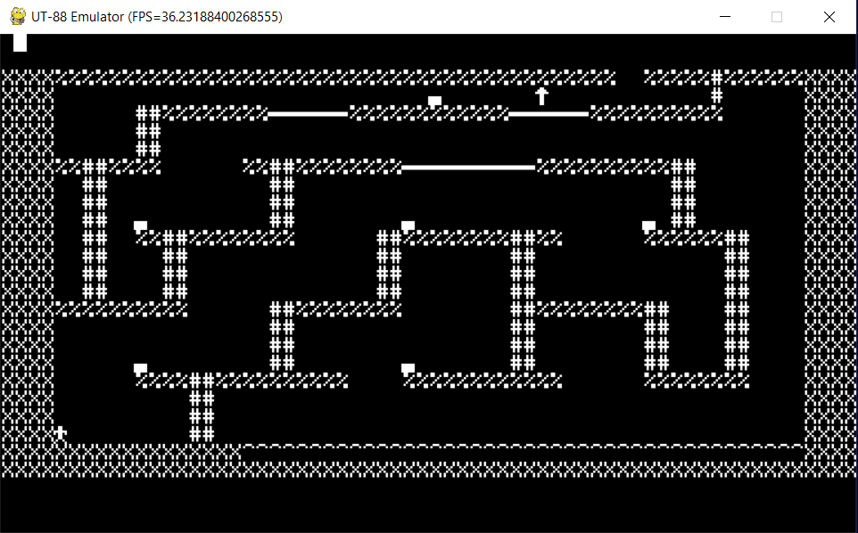

# 64k Dynamic RAM

The upgrade to a 64k dynamic RAM module ([schematics](scans/UT38.djvu)) significantly enhances UT-88 computer memory capabilities. While the RAM module covers the entire 64k address space, it includes special logic to disable the dynamic RAM for specific address ranges, such as `0xe000`-`0xefff` (video RAM) and `0xf000`-`0xffff` (reserved for Monitor F RAM/ROM). As a result, the effective dynamic RAM size is 56k.

This additional RAM capacity opens up the possibility of running a wider range of programs on the UT-88. It is claimed that the UT-88 is programmatically compatible with other computers in the same class, particularly the Micro-80 and Radio-86RK. However, compatibility is only partial, as some programs designed for the Radio-86RK write directly to video memory or make use of the i8275 video controller (which is not available in the UT-88). These differences can result in incompatibility with many Radio-86RK games.

Nonetheless, there are examples of Radio-86RK games that can run on the UT-88, thanks to the compatibility provided by Monitor F functions. Programs that communicate with the keyboard and display using Monitor F functions will work as expected on the UT-88. For instance, Treasure game ([Disassembly](disassembly/klad.asm)) and the more recently developed 2048 game ([Disassembly](disassembly/2048.asm)) are two examples of Radio-86RK games that are compatible with the UT-88.

In this emulator the [Video configuration](cfg_video.md) employs 32k of the RAM space, while the [UT-88 OS](cfg_ut88os.md) and [CP/M](cfg_cpm.md) add the full memory range to the computer.
