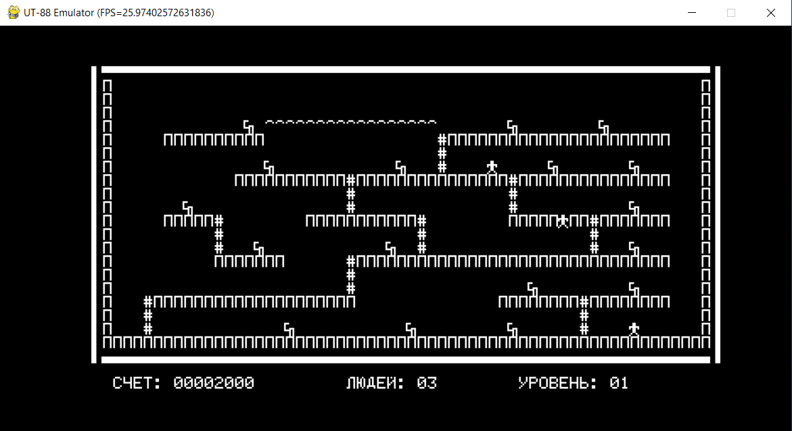

# Radio-86RK

The Radio-86RK is a foundational computer in the family and the predecessor of the UT-88. While the Radio-86RK is a more popular DIY computer, this comparison is UT-88-centric.

The Radio-86RK computer features a video adapter based on the Intel 8275 chip, working in conjunction with the Intel 8257 DMA controller. This collaboration facilitates the transfer of video RAM contents into the video controller without direct involvement from the main CPU. The main drawback of this approach is that the DMA controller shares the same address and data buses with the CPU, resulting in the CPU being halted during data transfer. This interruption negatively impacts time-critical routines, such as tape input and output. To work around this, the tape functions temporarily disable video output and re-enable it upon completion.

The Radio-86RK schematics don't allocate a dedicated video RAM. Instead, the screen buffer is located in the main memory. The DMA controller is configured to transfer the video RAM contents to the video controller. The screen size is 78x30 characters, and the video buffer of 78 x 30 = 2340 (0x924) bytes is situated at 0x76d0. However, not all characters are visible on the screen due to CRT margins. To address this, 8 characters on the left, 6 characters on the right, 3 lines at the top, and 2 lines at the bottom are programmatically disabled. The Monitor software is responsible for managing these margins and ensuring that no valuable data is written into non-visible areas. Consequently, the effective screen size is only 64x25 lines, and part of the video memory is unused.

The i8275 chip allows for slightly reconfiguring the video chip if necessary. Thus, some programs or games may increase the number of rows on the screen by removing spacing between rows. In this case, the amount of video RAM is increased, but it can be easily moved to another address by reconfiguring the DMA controller. Some programs may even use non-visible rows and columns to store some information.

In comparison to the RK86 video adapter, the UT-88's adapter is based on a number of timer/counter and logic gate chips. These chips are responsible for generating the video synchronization signals, taking into account the duration of strobes and pauses between them. Importantly, these chips generate dead rows and columns that are not visible on the screen, preventing video RAM wastage for non-visible characters.

The UT-88 features a dedicated video RAM located at the fixed address `0xe800`. The effective video screen size is 64x28 characters. The screen width of 64 (0x40) significantly simplifies character position calculations and allows for the use of simple bit shift operations. The only feature UT-88 lacks compared to the Radio-86RK is hardware cursor support, but it is emulated programmatically by inverting a symbol at the cursor position.

Another significant difference between the Radio-86RK and UT-88 is how peripheral devices are connected to the CPU. In the Radio-86RK, devices are connected as memory-mapped devices, allowing access to these peripherals by reading or writing certain memory cells. The drawback of this approach is that only 32k of RAM is available to the user. Peripheral devices use only a few memory cells, but they do not allow creating a consecutive RAM for the entire address space due to fragmentation. In the UT-88 design, peripheral devices are connected to the I/O space. This allows for the creation of a consecutive RAM space for almost the entire address space.

The Radio-86RK utilizes a 67-key keyboard organized as an 8x8 matrix, along with a few standalone keys. Although the schematic is very similar, the key layout on the matrix is different. The keyboard matrix includes not only alphanumeric and some control keys (e.g., arrows) but also 5 functional buttons (F1-F5) that are supposed to be user-assignable. However, there is no support for these keys in the Monitor.

Entering Cyrillic characters is a bit different compared to the UT-88. In the UT-88, the Rus key works like a modifier key, requiring the user to hold the Rus key to enter Cyrillic characters. In contrast, in the Radio-86RK, the Rus key functions as a toggle, maintaining the new state for the next input. The mode is indicated with an LED so that the user knows which mode is currently enabled.

Other differences between the Radio-86RK and UT-88 include:
- Radio-86RK uses a CR/LF sequence for a new line, behaving literally like carriage return (in the same line) and line feed (keeping the existing cursor column position). The UT-88 uses only LF (0x0a) acting as both carriage return and line feed, while CR (0x0d) is ignored.
- Radio-86RK has dedicated LF, F1-F5 keys, separate backspace, and Escape (AR2) buttons, while the UT-88 does not have these buttons. Conversely, the UT-88 has a '_' symbol not available on the Radio-86RK.
- Both Radio-86RK and UT-88 use the same (or very similar) font ROM, though there are several alternate fonts for Radio-86RK available on the Internet.
- The Radio-86RK Monitor obviously has a different implementation for hardware-related functions (tape, display, keyboard) but uses very similar algorithms. Non-hardware-related functions (such as memory commands) are identical in both Radio-86RK and UT-88 Monitors, including some peculiarities like making tape delays using random stack read operations.
- Monitor Commands K and V are not available in the Radio-86RK.
- Radio-86RK does not have a time module.
- Radio-86RK does not use hardware interrupts.
- Radio-86RK uses the EI pin for sound generation. The level on this pin is changed with DI/EI instructions. Instead, UT-88 uses the tape port for sound generation.

Memory map of the Radio-86RK computer:
- `0x0000` - `0x7fff`: 32k general-purpose RAM, including Video RAM. 16k version of the computer uses the range `0x0000` - `0x3fff`
- `0x8000` - `0x8003`: Intel 8255 PPI chip that is used for the keyboard matrix, and Rus LED. Port C is also used for tape input and output.
- `0xa000` - `0xa003`: Additional Intel 8255 port, used for external ROM.
- `0xc000` - `0xc001`: Intel 8275 video controller chip.
- `0xe000` - `0xe008`: Intel 8257 DMA controller chip.
- `0xf800` - `0xffff`: Monitor ROM.

A classic [Lode Runner](../tapes/LRUNNER.rku) game ([disassembly](disassembly/LRUNNER.asm)) is added as an example of Radio-86RK game.

# Running the Radio-86RK in the Emulator

Radio086RK emulator can be started as follows:
```
python src/main.py radio86rk
```

The configuration enables 32k RAM. Video and DMA controllers are emulated to a level sufficient to run Radio-86RK programs. Keyboard is emulated for Latin letters and control symbols (Cyrillic letters mode is not implemented). Sound via EI/DI instructions is not supported. 

Some pieces of the Monitor code are switched off in the emulator (see [setup_special_breakpoints()](../src/main.py). This is because of limitations of the emulation. Thus the real hardware reconfigure CRT and DMA controllers when performing tape operations. This behavior is hard to emulate, but in fact it is not really needed when running under the emulator, so these functions are just bypassed.



