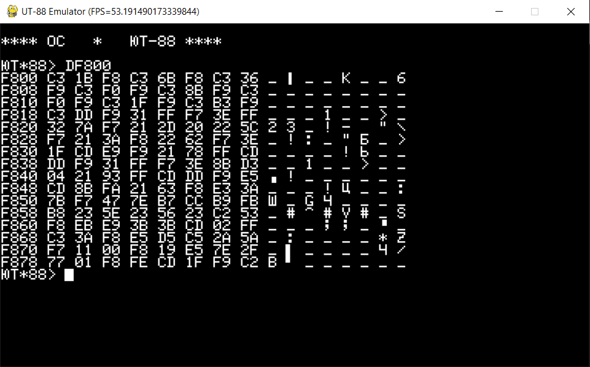
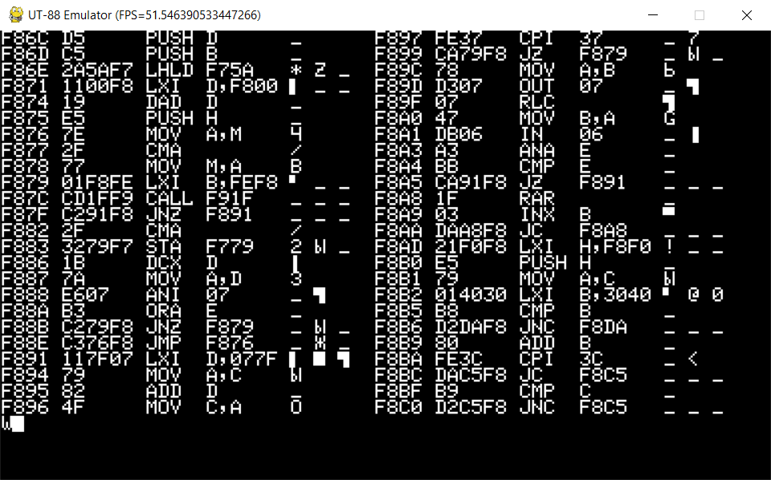

# UT-88 Operating System

The [64k RAM](64k_mod.md) configuration, with some minor modifications, enables the UT-88 to run what is referred to as the "UT-88 OS". This OS is presented as an operating system tailored specifically for the UT-88, although it should be noted that it doesn't adhere to the classical definition of an operating system. In essence, the UT-88 OS serves as a suite of tools and programs that enhance the UT-88's capabilities, making it more versatile and suitable for a range of programming and development tasks.

The components of this package include:
- **Extended Monitor**: This version of the Monitor offers an expanded set of commands, including features like a blinking cursor and improvements in text output (such as scroll control).
- **Development Tools**: The OS includes a set of development tools, such as the ability to run programs with two software breakpoints, a program relocator, an interactive disassembler, and an assembler.
- **"Micron" Text Editor**: The package incorporates a full-screen text editor known as "Micron". This editor provides users with text editing capabilities and is designed to work seamlessly within the UT-88 environment.
- **"Micron" Assembler**: This is another assembler tool in the UT-88 suite, providing a reacher syntax.

It's important to note that the UT-88 OS doesn't introduce a specific API layering, akin to what is found in operating systems like CP/M. Instead, it retains a mixture of functions that are closely related to hardware operations (e.g., keyboard, display, tape recorder), middleware (e.g., line editing functions), and higher-level programs (e.g., the interactive assembler). At the same time, the 'Micron' text editor and assembler are standalone programs that could potentially be adapted for use on other systems with minor modifications.

The UT-88 OS is loaded into memory through a [single bootstrap binary file](../tapes/UT88.rku) ([disassembly](disassembly/ut88os_boot.asm)). As a part of the bootstrap loading, the User is asked to deactivate the Monitor ROM (as well as any other ROMs, if present) and enable RAM at the corresponding addresses. Once the system is reconfigured in this manner, the bootstrap program takes over and proceeds to copy the different components of the UT-88 OS to their designated memory locations.

Here is an overview of the memory map in the UT-88 OS configuration, assuming that the OS components have already been loaded by the bootstrap program:
- `0x0000` - `0xbfff` - This region represents general-purpose RAM. Some portions of this range are reserved for specific purposes:
  - `0x3000` - `0x9fff` - Text area used by the text editor for storing edited text and by assemblers for source code.
  - `0xa000` - `0xbfff` - Default area for binary code generated by the assembler.
- `0xc000` - `0xcaff` - This segment contains an additional part of the Monitor, which includes various [additional functions](disassembly/ut88os_monitor2.asm), [interactive assembler/disassembler](disassembly/ut88os_asm_disasm.asm), and some other development tools.
- `0xcb00` - `0xd7ff` - ['Micron' text editor](disassembly/ut88os_editor.asm)
- `0xd800` - `0xdfff` - ['Micron' assembler](disassembly/ut88os_micron_asm.asm)
- `0xe000` - `0xefff` - Video RAM
- `0xf400` - `0xf5ff` - A special area reserved for labels and references used during the compilation of assembler code.
- `0xf600` - `0xf7ff` - This segment is used for storing variables related to the Monitor and other UT-88 OS programs.
- `0xf800` - `0xffff` - The main part of the [Monitor](disassembly/ut88os_monitor.asm) is located in this region. It includes hardware functions and handles basic command processing.

It appears that the documentation and software for the UT-88 OS suffer from various shortcomings, including insufficient command explanations, discrepancies between documented behavior and actual implementation, and mistakes in command names and descriptions. These issues can certainly make it challenging for users to understand and effectively use the software. Additionally, there are compatibility issues between various OS components, which suggest that UT-88 OS may have been assembled from different sources without thorough testing.

Published binary codes also contains a lot of mistakes (for example `0x3c00`-`0x3fff` range of the [UT-88 OS binary code](scans/UT44.djvu) is misplaced with a similar range of [CP/M-35 binary](scans/UT56.djvu)). Some code is obviously wrong (incorrect addresses or values used) and simply does not work out of the box. 

The following subchapters describe UT-88 OS software in detail.

## UT-88 OS Monitor

The UT-88 OS Monitor shares many similarities with the MonitorF in terms of its main entry points and functionalities. Although the API is narrower, it still provides basic I/O operations, tape input/output, display operations, and keyboard interactions:
- `0xf800`    - Software reset
- `0xf803`    - Wait for a keyboard press, returning the entered symbol in register A
- `0xf806`    - Input a byte from the tape (A - number of bits to receive or `0xff` if synchronization is needed). Returns the received byte in register A
- `0xf809`    - Put a character to the display at the cursor location (C - character to print)
- `0xf80c`    - Output a byte to the tape (C - byte to output)
- `0xf80f`    - This function is supposed to print a byte on a printer. Since the printer connectivity is not implemented in UT-88, this function is just an alias for `0xf809` (put char to the display)
- `0xf812`    - Check if any button is pressed on the keyboard (A=`0x00` if no buttons are pressed, `0xff` otherwise)
- `0xf815`    - Print a byte in a 2-digit hexadecimal form (A - byte to print)
- `0xf818`    - Print a NULL-terminated string at the cursor position (HL - pointer to the string)

The character output function in the UT-88 OS Monitor is slightly simplified compared to its MonitorF counterpart, and lacks support for the Esc-Y cursor positioning sequence. The scrolling behavior, where the cursor moves beyond the last line is similar to that of MonitorF.

Two scroll modes are supported:
- Continuous scroll, similar to MonitorF: When the screen is entirely filled, it scrolls up by one line, and a new line is printed in the freed last line.
- Page turning: When the screen is filled, the Monitor awaits a key press. Upon input, it clears the page, providing a fresh canvas for new lines.

The character output function recognizes several control symbols:
- `0x08` - Move the cursor one position to the left.
- `0x0c` - Move the cursor to the top-left position.
- `0x18` - Move the cursor one position to the right.
- `0x19` - Move the cursor one line up.
- `0x1a` - Move the cursor one line down.
- `0x1f` - Clear the screen.

Unlike MonitorF, there is no direct Esc-Y cursor positioning sequence. Instead, some programs utilize the `0x0c` (home cursor) control symbol, followed by a specific number of `0x1a` (cursor down) and `0x18` (cursor right) characters.

The UT-88 OS Monitor supports a range of commands for memory operations, tape recorder functions, mode and helper commands, and program execution. Here's a detailed breakdown:
- **Memory commands**:
  - Command M: View and edit memory
      M `<addr>`                                    - View and edit memory starting at `addr`
  - Command K: Calculate and print CRC for a memory range
      K `<addr1>`, `<addr2>`                        - Calculate CRC for the range `addr1`-`addr2`
  - Command C: Memory copy and compare
      C `<src_start>`, `<src_end>`, `<dst_start>`   - Compare memory data between two ranges
      CY `<src_start>`, `<src_end>`, `<dst_start>`  - Copy memory from one range to another
  - Command F: Fill or verify memory range
      FY `<addr1>`, `<addr2>`, `<constant>`         - Fill memory range with the constant
      F `<addr1>`, `<addr2>`, `<constant>`          - Compare memory range with the constant, report differences
  - Command D: Dump the memory
      D                                             - Dump 128-byte chunk of memory, starting the user program's HL
      D`<start>`                                    - Dump 128-byte chunk, starting from the specified address
      D`<start>`,`<end>`                            - Dump memory for the specified range
  - Command S: Search string in a memory range
      S `maddr1`, `maddr2`, `saddr1`, `saddr2`      - Search string located `saddr1`-`saddr2` in a memory range `maddr1`-`maddr2`
      S `maddr1`, `maddr2`, '`<string>`'            - Search string specified in single quotes in `maddr1`-`maddr2` memory
      S `maddr1`, `maddr2`, &`<hex>`, `<hex>`,...   - Search string specified in a form of hex sequence in specified memory range
  - Command L: List the text from the memory
      L `<addr1>`[, `<addr2>`]                      - List text located at `addr1`-`addr2` range
- **Tape recorder commands**:
  - Command O: Output data to the tape
      O `<addr1>`,`<addr2>`,`<offset>`[,`<speed>`]  - Output data for `addr1`-`addr2` range, at specified speed. `offset` parameter is not used
  - Commands I and IY: input data from the tape (IY - data input, I - data verification)
      I/IY                                          - Data start and end addresses are stored on the tape
      I/IY`<addr1>`                                 - Search for `addr1` signature on tape, then read `addr2` from the tape
      I/IY`<addr1>`,`<addr2>`                       - Search `addr1`/`addr2` sequence on the tape
      I/IY`<space>``<addr1>`                        - Tape data is loaded to the address provided as a parameter
      I/IY`<space>``<addr1>`,`<addr2>`              - Data start and end addresses are specified as parameters. `addr2` can be used to limit the amount of data to be loaded.
  - Command V: Measure tape delay constant
- **Mode and Helper commands**:
  - Command R: enable or disable scroll
      R`<any symbol>`                               - Enable scroll
      R                                             - Disable scroll (clear screen if full page is filled)
  - Command T: trace the command line
      T`<string>`                                   - Print command line string in a hexadecimal form
  - Command H: Calculate sum and difference between the two 16-bit arguments
      H `<arg1>`, `<arg2>`                          - Calculate and print the sum and difference of the two args
- **Program execution commands**:
  - Command G: Run user program
      G `<addr>`                                    - Run a user program from `<addr>`
      GY `<addr>`[,`<bp1>`[,`<bp2>`[,`<cnt>`]]]     - Run a user program from `<addr>`, set up to two breakpoints. This command also sets/restores registers previously set by the Command X (edit registers) or captured during breakpoint handling. 
  - Command X: View and edit CPU registers
  - Command J: Quick jump
      J`<addr>`                                     - Set the quick jump address
      J                                             - Execute from the previously set quick jump address
- **Interactive assembler and disassembler commands** (see description below):
  - Command A: assembler
  - Command N: interactive assembler
  - Command @: assembler second pass
  - Command W: disassembler
  - Command Z: clear reference/label table
  - Command P: Relocate program
- **Other programs execution commands** (see respective descriptions below)
  - Command E: run Micron editor
  - Command B: run Micron assembler
  
Refer to a respective monitor disassembly ([1](disassembly/ut88os_monitor.asm), [2](disassembly/ut88os_monitor2.asm)) for a more detailed description of the commands' parameters and algorithm.

The UT-88 OS Monitor does not include time counting functions, and the time interrupt should be switched off while working with the OS. 

The UT-88 OS Monitor has a couple of inconsistencies compared to the original UT-88 MonitorF, particularly in the display module design and the handling of Ctrl key combinations.

The original display module design uses a single 2k video RAM at `0xe800`-`0xef00` range. Each byte's lower 7 bits represent a character code, while the MSB is responsible for symbol highlighting (inversion). The UT-88 OS Monitor code expects a different hardware design. The `0xe800`-`0xef00` range is used for symbol character codes only, while a parallel range `0xe000`-`0xe700` is used for symbol attributes (only MSB is used, other 7 bits are ignored). This may create compatibility issues with the official hardware, and it's worth noting that this alternate schematics is implemented in this emulator.

Another incompatibility is related to Ctrl key handling. When `Ctrl-<char>` key combination is pressed, the original MonitorF produces the `<char>`-`0x40` code. This means that the returned character code is in the `0x01`-`0x1f` range. This design provides a single keycode for Ctrl-char key combinations without requiring additional actions. Some UT-88 OS programs, including the Monitor itself (but not including the Micron assembler), expect a different behavior. Symbol keys are returned as is (in the `0x41`-`0x5f` range), and additional code reads the keyboard's port C to check whether the Ctrl key is pressed.

The emulator is using [fixed version](../tapes/ut88os_monitor.rku) of the monitor by default. Difference with original version are described in details [here](../tapes/ut88os_monitor.diff).

## Interactive assembler and disassembler

The UT-88 OS comes with a set of development tools, built around a simple assembler and disassembler, and share some internal functions and approaches. The tools are described in details in the [assembler/disassembler disassembly](disassembly/ut88os_asm_disasm.asm).

The **Assembler** compiles source code located at `0x3000`-`0x9fff` into a machine code, and stores it to `0xa000`+ location. The compiler supports a relatively simple syntax that covers all i8080 instructions. Immediate values can be represented as decimals or hexadecimal numbers, or character symbols. Simple mathematical expressions with + and - operations between values are allowed.

The assembler operates in two passes. The first pass performs the actual compilation of the source code. The second pass is responsible for substituting label references. The two-pass processing and support for labeled references enable the assembler to handle more complex source code with forward references, common in assembly language programming. Users can choose to execute specific passes or clear the label table based on their needs.

Labels are represented in source code using the syntax `@<lbl>`, where `<lbl>` is a 2-digit hexadecimal number. Label values are stored in the dedicated range `0xf400`-`0xf600` (2 bytes per label). Each label record corresponds to a label, and the address is calculated based on the label number.

The **Interactive Assembler** in the UT-88 OS utilizes the same compilation engine as the standard assembler but allows users to enter source code interactively line by line. This provides a more dynamic coding experience compared to the standard assembler. It suits users who prefer to interactively develop and test assembly language code, offering flexibility in the compilation process. 

Similar to the standard assembler, the Interactive Assembler operates in two passes. Users have the option to perform the first pass, the second pass, or both during the interactive session.

The **Interactive Disassembler** in the UT-88 OS is a tool that allows users to interactively perform the disassembly of a specified memory range. The disassembler analyzes the machine code within the specified range and generates a human-readable assembly language listing. 

The disassembly listing is presented to the user page by page. Users can view up to two pages of disassembled program simultaneously on the screen. The display is divided into left and right parts, each capable of showing a page of disassembled code. After displaying each page, the Interactive Disassembler waits for the user input.
The user can input commands such as '1' to print the next page on the left part of the screen, '2' to print the page on the right, or a space bar to print the next page on the opposite side compared to the previous one.

The **Program Relocator** in the UT-88 OS is a specialized tool designed to relocate a program from one memory address range to another. The relocator focuses on relocating machine code (program) from a source memory range to a target memory range. It looks for 2- and 3-byte instructions within the code that reference the source memory range. When the relocator identifies instructions referencing the source memory range, it corrects these references to point to the target memory range. This correction ensures that the program operates correctly in the new memory location.

The relocator always works with a copy of the original program. This approach ensures that modifications made during the relocation process do not impact the integrity of the source program. The relocator provides the flexibility to prepare a relocated program for use in a memory range that may not exist on the computer.
Users can specify both the source and destination memory ranges as well as an additional target memory range, allowing for flexibility in relocating programs to hypothetical or non-standard memory configurations.

The relocator program utilizes up to five parameters to facilitate the relocation process. These parameters include the source memory range, the target memory range, and the additional target memory range. Detailed information about the usage and parameters of the relocator program can be found in the [relocator command description](disassembly/ut88os_asm_disasm.asm) in the disassembly documentation.

Described tools are accessed using the following monitor commands:
- Command A - Assembler
  - A[@] [`target start addr`]    - compile text located at `0x3000`-`0x9fff` to `0xa000` (or another specified address). The @ modifier runs the 2nd pass as well (by default, only the 1st pass is executed).

- Command N - Interactive assembler
  - N[@] [`addr`]                 - Enter program lines interactively, storing the compiled program at 0xa000 (or another specified address). The @ modifier runs the 2nd pass after all input lines are entered.

- Command @ - Run assembler 2nd pass explicitly
  - @ [`addr1`, `addr2`]          - Run the assembler 2nd pass for the specified address range (or `0xa000`-`0xaffe`)

- Command W - Interactive disassembler
  - W <`start`>[, <`end>`]        - Run the interactive disassembler for the specified memory range.

- Command Z - View or clean labels area
  - Z                             - Show `0xf400`-`0xf600` labels area, listing the current values of each label.
  - Z0                            - Zero all labels

- Command P - relocate program from one memory range to another
  - P[N] `<w1>`,`<w2>`,`<s1>`,`<s2>`,`<t>`  -  Relocate the program from `s1`-`s2` to the `<t>` target address range, using `w1`-`w2` as a working copy (source program is not modified, only the working copy is modified).
  - P@ `<s1>`,`<s2>`,`<t>`                  - Adjust addresses in the `0xf400`-`0xf600` labels area


Refer to the [assembler tools disassembly](disassembly/ut88os_asm_disasm.asm) for assembler syntax details, command arguments descriptions, and implementation notes.


## 'Micron' Editor

The 'Micron' Editor is a text editing application that comes as part of the UT-88 OS package. It provides various features for full-screen text editing in the UT-88 computer environment. Here is an overview of its features:
- Micron Editor supports full-screen text editing.
- It can handle up to 28k of text in the `0x3000`-`0x9fff` memory range.
- Each line can have up to 63 characters. Lines are terminated with the \r character, and text ends with a symbol with a code greater than or equal to `0x80`.
- Users can switch between insert and overwrite modes for text entry.
- Users can navigate the cursor using arrow buttons, as well as Page Up/Down (with Ctrl-Up/Down keys).
- Insert or delete characters under the cursor with Ctrl-Left/Right. Insert or delete a line with Ctrl-A/Ctrl-D key combinations.
- Users can search for a substring within the text.
- Micron Editor allows users to set the tab size as either 4 or 8 characters. Tabs can be entered with the Ctrl-Space key combination.
- Users can input and output text from/to the tape recorder. Text in memory can be verified against the tape.
- Users can append a file from the tape to the text currently loaded in memory.

It's important to note that some features commonly found in modern text editors, such as copy/paste, line wrapping, and undo/redo functionality, are not present in the 'Micron' Editor. 

When launching the 'Micron' Editor program, it begins with a prompt, awaiting user commands. The user can load an existing text from tape using Ctrl-I, or create a new text file using Ctrl-N. If the text was already loaded in any other way, the User can switch from prompt to text editing mode using Up or Down keys.

Due to performance reasons, the 'Micron' Editor operates with one line at a time. When line editing is finished, the line is submitted to the text. Unfortunately there is no way to split a single line into several lines.

The 'Micron' Editor in the UT-88 OS offers a variety of key combinations and commands for efficient text editing. Here's a summary of the supported keys and commands:
- Pressing alphanumeric or symbol keys inputs characters into the text. Depending on the insert/overwrite mode, a new symbol is either inserted at the cursor position (shifting the rest of the line right) or overwrites the symbol at the cursor position (maintaining the line size). The Ctrl-Y key combination toggles the insert/overwrite mode.
- The Ctrl-Space key combination adds spaces up to the next 4-char or 8-char tab stop (Ctrl-W command toggles the tab width).
- Ctrl-Left/Ctrl-Right performs deletion/insertion of a symbol at the cursor position, with insertion occurring even in overwrite mode.
- Arrow keys (Up/Down/Left/Right) move the cursor on the screen. If the cursor reaches the top or bottom of the screen, it is scrolled by one line.
- Ctrl-Up/Ctrl-Down performs page up or down.
- Ctrl-L searches for a substring in the entire text file.
- Ctrl-X searches for a substring from the current line to the end of the file.
- Ctrl-D is intended to delete one or more lines. The command works only at the beginning of the line. When Ctrl-D is pressed, the line is marked with a # symbol indicating a range start. Users can navigate to a point later in the file with Up/Down arrows or Ctrl-Up/Down keys, selecting the end range to delete. It is possible to select only entire lines; deleting part of the line with Ctrl-D is not possible. Another Ctrl-D press performs the deletion. The Clear Screen button exits the range selection and cancels the mode.
- Ctrl-A adds a new line after the current line. The command works only at the beginning of the line. When a line is added, the user can enter text into a new line. The command allows adding multiple lines. The Return key submits the added line, and the Clear Screen key exits the mode.
- Ctrl-T command is similar, but text is added at the end of the text file.
- Ctrl-N creates a new empty text file. Previous text is cleared.
- Ctrl-F prints the current text file size and free memory stats.
- Ctrl-O outputs the current text to the tape. The user enters the file name, which is stored on the tape in the file header. The storage format is slightly different compared to the format used by the Monitor. This makes it impossible to load text files exported from the Editor in the Monitor, and vice versa. Loading binary data as text is not allowed. The format uses a different pilot tone so that text and binary can be audibly distinguished.
- Ctrl-I loads a text from the tape. The user enters the expected file name, and the function searches for the matched file name on the tape.
- Ctrl-V is similar to the previous command, but instead of loading text data from the tape, it verifies that the text in memory matches the text on the tape.
- Ctrl-M appends a file on tape to the current text.
- Ctrl-R toggles the default Monitor's tape delay constants with shorter ones, allowing text to be saved at a faster speed.
- The Clear Screen key exits to the Monitor.

Perhaps this editor is a hastily adapted version from another system. It was designed to operate on a system with a 32-line screen, whereas UT-88 provides only a 28-line screen. This results in very peculiar visual rendering, making it nearly impractical for effective text editing. Numerous adjustments were necessary to ensure the editor's functionality on the UT-88 display. Another compatibility concern arises from how Ctrl symbols are managed by the monitor. The editor anticipates a symbol to be returned conventionally (within the `0x20`-`0x7f` range), and reading Keyboard Port C allows checking the Ctrl key state. As the Monitor behaves differently, the editor code demands a patched Monitor that returns normal char codes even when pressed in combination with Ctrl.

Refer to the [editor disassembly](disassembly/ut88os_editor.asm) for more detailed description. The emulator is using [fixed version](../tapes/ut88os_editor.rku) of the editor by default. [Difference with original version](../tapes/ut88os_editor.diff) are explained in details.


## 'Micron' assembler

This program is another assembler utility included in the UT-88 OS Bundle. It provides slightly more advanced assembly capabilities compared to the built-in assembler, offering more precise control over the target address through directives such as ORG and DS, and introduces improvements to label handling. Unlike the built-in assembler, which uses numbered labels, this version allows the definition of 6-character long symbolic labels, significantly enhancing the readability of the source code. In terms of general i8080 assembler syntax, it provides standard features for expressions, allowing the use of decimal and hex digits, symbol char codes, and $ as the current address, among others.

Upon startup, the program prompts the user to select a working mode. The following working modes are supported:
- '1' - Silent mode: The source code is compiled without detailed error reporting.
- '2' - Verbose mode: The compiler dumps the source code, annotating each line with the obtained target address, generated byte code, EQU, and label values. In case of a compilation error, the dumped line will contain an error code.
- '3' - Label values: Similar to silent mode, but also dumps label and EQU values.

Regardless of the mode, the program provides general statistics on the compiled program, including:
- Number of detected errors
- Last byte execution address of the compiled program
- Last byte storage address of the compiled program

In verbose mode, the assembler provides error codes if any syntax errors are detected during compilation. The error code is a bitmask representing possible errors:

- 0x01    - Label problem (e.g. double label definition).
- 0x02    - Label not found.
- 0x04    - Unexpected symbol error (e.g. expecting a character, but a digit is found, or encountering an invalid instruction mnemonic).
- 0x08    - Syntax error (incorrect expression structure, unexpected end-of-line, missing mandatory arguments, etc).
- 0x10    - Label-related syntax error (e.g., a label is not followed by a colon).

The compilation process consists of two passes:
- The first pass calculates label addresses and stores them in the labels table.
- The second pass is responsible for actual code generation, where all expression values are calculated using the correct label values set during the first pass.

Unlike the built-in assembler, there is no option to specify the number of passes to execute; both passes are executed during the compilation process.

Detailed description of the assembler syntax, as well as implementation details can be found in the [assembler disassembly](disassembly/ut88os_micron_asm.asm).


# Running UT-88 in the emulator

To run the emulator with UT-88 OS enter this command:
```
python src/main.py ut88os
```

This configuration skips the [UT-88 OS bootstrap module](../tapes/UT88.rku), as it requires reconfiguration of RAM and ROM components on the fly. Instead, it loads UT-88 OS components directly to their target locations, as they would be loaded by the bootstrap module.

Unfortunately the UT-88 OS is pretty raw and contains a lot of bugs. Most critical of them are fixed right in the binary (see [detailed description](../tapes/ut88os_monitor.diff)), other worked around with special hooks in [setup_special_breakpoints()](../src/main.py) function (refer the code for moore details)



